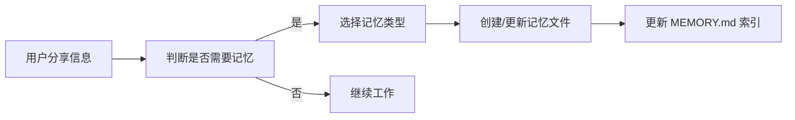

# memory/ 目录使用说明

## 概述

`memory/` 目录用于存储各类记忆文件，让 Claude Code 在不同会话之间保持上下文和知识的连续性。

## 目录结构

```
.claude/memory/
├── MEMORY.md              # 记忆索引文件
├── user_*.md              # 用户相关记忆
├── feedback_*.md          # 用户反馈记忆
├── project_*.md           # 项目相关记忆
└── reference_*.md         # 参考资源记忆
```

## 记忆类型

### 1. user - 用户记忆

记录用户的角色、目标、知识水平和偏好。

#### 文件命名

```
user_role.md       # 用户角色
user_preferences.md # 用户偏好
user_expertise.md   # 用户专长
```

#### 文件格式

```markdown
---
name: 用户角色
description: 用户是前端工程师，擅长 React 和 TypeScript
type: user
---

# 用户角色

## 基本信息
- 角色：前端工程师
- 经验：5年
- 主要技术：React, TypeScript, Node.js

## 专长领域
- 前端架构设计
- 性能优化
- 组件库开发

## 学习目标
- 深入学习 Rust
- 掌握 WebAssembly
```

#### 使用场景

- 需要根据用户水平调整解释方式
- 用户询问与其领域相关的问题
- 需要判断某个建议是否适合用户

### 2. feedback - 反馈记忆

记录用户对工作方式的反馈和指导。

#### 文件命名

```
feedback_style.md       # 编码风格反馈
feedback_process.md     # 工作流程反馈
feedback_communication.md # 沟通方式反馈
```

#### 文件格式

```markdown
---
name: 编码风格偏好
description: 用户喜欢函数式编程，避免使用类
type: feedback
---

# 编码风格反馈

## 规则
- 优先使用函数式组件
- 避免使用 class 组件
- 使用自定义 Hooks 管理状态

## Why: 用户体验
用户发现函数式组件更容易理解和维护

## How to apply
在编写 React 组件时，默认使用函数式写法
```

#### 使用场景

- 用户纠正了某个做法
- 用户确认某种方式很好
- 需要避免重复犯错

### 3. project - 项目记忆

记录项目的背景、目标、时间线等信息。

#### 文件命名

```
project_goals.md        # 项目目标
project_deadline.md     # 项目截止日期
project_team.md         # 团队成员
project_context.md      # 项目背景
```

#### 文件格式

```markdown
---
name: 项目目标
description: 电商平台重构，计划 Q3 上线
type: project
---

# 项目目标

## 主要目标
- 重构旧版电商平台
- 提升页面加载速度 50%
- 改善移动端体验

## Why: 业务需求
旧平台性能差，影响转化率

## How to apply
所有代码变更优先考虑性能优化
```

#### 使用场景

- 需要理解项目背景做决策
- 有时间敏感的任务
- 需要与团队协作

### 4. reference - 参考记忆

记录外部资源的链接和用途。

#### 文件命名

```
reference_docs.md       # 文档链接
reference_tools.md      # 工具链接
reference_apis.md       # API 参考
```

#### 文件格式

```markdown
---
name: 参考文档
description: 项目相关的官方文档链接
type: reference
---

# 参考文档

## API 文档
- [后端 API](https://api.example.com/docs)
- [组件库文档](https://ui.example.com)

## 监控面板
- [错误监控](https://sentry.example.com)
- [性能监控](https://perf.example.com)
```

#### 使用场景

- 需要查阅官方文档
- 需要检查监控数据
- 需要使用特定工具

## 最佳实践

### 1. 及时保存

```markdown
# 当用户说"记住这个"时立即创建记忆
# 当用户纠正错误时记录反馈
# 当了解新信息时更新记忆
```

### 2. 准确分类

```markdown
# 用户信息 → user 类型
# 用户反馈 → feedback 类型
# 项目信息 → project 类型
# 外部链接 → reference 类型
```

### 3. 定期清理

```markdown
# 删除过时的项目记忆
# 更新不再准确的用户信息
# 移除已失效的参考链接
```

## 注意事项

1. **不要重复存储**：代码模式和项目结构可以从代码中获取，不需要记忆
2. **保持更新**：项目状态变化时及时更新记忆
3. **验证准确**：使用记忆前验证信息是否仍然有效
4. **简洁明确**：记忆文件应该简洁，突出重点

## 工作流程



## 示例记忆文件

### user_expertise.md

```markdown
---
name: 用户技术专长
description: 前端专家，后端新手
type: user
---

# 技术水平

## 精通
- React / TypeScript
- CSS / Tailwind
- 前端工程化

## 熟悉
- Node.js
- GraphQL

## 学习中
- Rust
- WebAssembly
```

### feedback_testing.md

```markdown
---
name: 测试要求
description: 必须为所有功能编写测试
type: feedback
---

# 测试反馈

## 规则
- 新功能必须有单元测试
- 覆盖率不能低于 80%
- 使用 Vitest 运行测试

## Why: 之前的问题
曾因为缺少测试导致生产环境故障

## How to apply
每次完成功能后运行测试并确保通过
```
