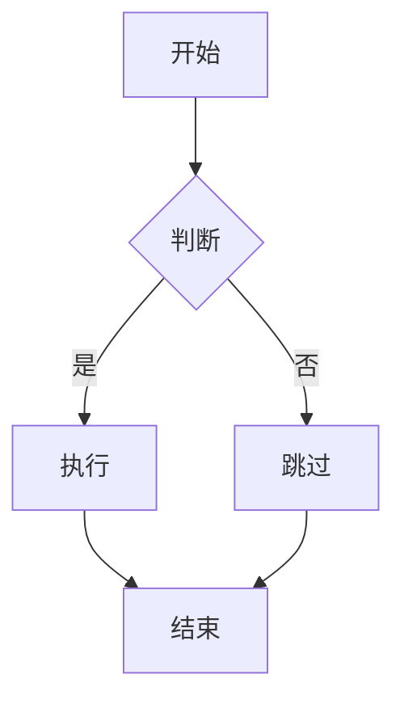

# Markdown 语法详解

## 0. Frontmatter（元数据）

Frontmatter 是 Markdown 文件顶部的 YAML 或 JSON 元数据区域，用于存储文档的配置信息、属性等。它由三根短横线 `---` 包裹，位于文件最开头（必须在任何正文内容之前）。

### 0.1 用法说明

#### 标准格式规范

Frontmatter 必须位于文件首行，使用 `---` 作为分隔符：

```yaml
---
title: 文档标题
date: 2024-01-01
---

# 正文内容从这里开始
```

#### YAML 格式（最常用）

```yaml
---
# 字符串类型（无需引号）
title: 我的文章

# 带引号的字符串
description: "这是一段描述"

# 数字类型
year: 2024
version: 1.0

# 布尔类型
published: true
draft: false

# 数组/列表类型
tags:
  - JavaScript
  - Vue
  - 前端

# 嵌套对象
author:
  name: 张三
  email: zhang@example.com

# 多行文本（使用 | 或 >）
bio: |
  这是多行文本
  第二行
  第三行
---

正文内容...
```

#### JSON 格式

```json
---
{
  "title": "我的文章",
  "date": "2024-01-01",
  "tags": ["JavaScript", "Vue"],
  "author": {
    "name": "张三",
    "email": "zhang@example.com"
  }
}
---
```

#### TOML 格式（部分框架支持）

```toml
+++
title = "我的文章"
date = 2024-01-01
tags = ["JavaScript", "Vue"]
+++
```

#### 在不同文件类型中的应用

| 文件类型 | 支持情况 | 说明 |
|----------|----------|------|
| Markdown (.md) | ✅ 完全支持 | 最常见的应用场景 |
| HTML (.html) | ✅ 部分支持 | 可在 HTML 注释中包含 |
| Vue 单文件 (.vue) | ✅ 完全支持 | `<script>` 标签内使用 |
| JSON (.json) | ❌ 不支持 | 本身已是结构化数据 |

### 0.2 核心作用

#### 内容管理

- **文档标识**：为每个文档提供唯一标识符
- **版本控制**：记录文档的版本号和修订历史
- **状态管理**：区分草稿和正式发布的文章
- **权限控制**：设置文档的访问权限级别

#### 元数据存储

- **结构化信息**：以标准化格式存储文档属性
- **便于检索**：支持按标题、日期、作者等快速检索
- **数据交换**：便于与其他系统进行数据交互

#### 页面配置

- **布局控制**：指定文档使用的页面模板
- **导航配置**：设置侧边栏菜单、面包屑等
- **SEO 优化**：配置搜索引擎需要的元信息
- **样式定制**：设置自定义样式类或主题

#### 内容分类与筛选

- **分类体系**：通过 categories 实现层级分类
- **标签系统**：使用 tags 进行多维度标记
- **时间归档**：按日期进行时间线归档
- **筛选查询**：支持按属性筛选特定文档

### 0.3 属性详解

#### 命名规范

| 规范类型 | 要求 | 示例 |
|----------|------|------|
| 小写字母 | 推荐使用小写 | `title`, `date`, `author` |
| 连字符 | 推荐使用 `-` 连接 | `page-style`, `side-bar` |
| 驼峰命名 | 部分框架支持 | `pageTitle`, `contentType` |
| 下划线 | 部分框架支持 | `publish_date`, `author_name` |

#### 常用属性列表

| 属性名 | 类型 | 必需 | 说明 |
|--------|------|------|------|
| `title` | string | 部分 | 文档标题 |
| `date` | date/datetime | 部分 | 发布/创建日期 |
| `updated` | date/datetime | 否 | 最后更新时间 |
| `author` | string/object | 否 | 作者名称 |
| `categories` | array | 否 | 分类（层级结构） |
| `tags` | array | 否 | 标签（扁平结构） |
| `description` | string | 否 | 文档描述 |
| `layout` | string | 否 | 使用的布局模板 |
| `permalink` | string | 否 | 自定义永久链接 |
| `draft` | boolean | 否 | 是否为草稿 |
| `published` | boolean | 否 | 是否发布 |
| `weight`/`priority` | number | 否 | 排序权重 |
| `image` | string | 否 | 封面图片 |
| `cover` | boolean | 否 | 是否显示封面 |
| `sidebar` | boolean/object | 否 | 侧边栏配置 |
| `math` | boolean | 否 | 是否启用数学公式 |
| `mermaid` | boolean | 否 | 是否启用图表 |
| `toc` | boolean | 否 | 是否显示目录 |

### 0.4 属性作用详解

#### title - 文档标题

```yaml
title: 我的第一篇文章
title: "深入理解 Vue 3 响应式原理"
```

- **功能**：定义文档的显示标题
- **取值**：字符串
- **影响**：用于页面标题、导航菜单、SEO 标题
- **说明**：如果不设置，某些框架会使用文件名作为标题

#### date - 发布日期

```yaml
date: 2024-01-15
date: 2024-01-15 10:30:00
date: 2024/01/15
```

- **功能**：记录文档创建或发布时间
- **取值**：日期格式（YYYY-MM-DD 或 YYYY-MM-DD HH:mm:ss）
- **影响**：用于时间排序、归档显示、RSS feed 生成
- **注意**：时区问题可能导致显示差异

#### updated - 更新时间

```yaml
updated: 2024-06-20 15:00:00
```

- **功能**：记录文档最后修改时间
- **取值**：日期格式
- **影响**：显示"最后更新"信息，触发内容重新发布

#### author - 作者

```yaml
# 简单形式
author: 张三

# 完整形式
author:
  name: 张三
  email: zhang@example.com
  url: https://zhang.example.com
```

- **功能**：标明文档作者信息
- **取值**：字符串或对象
- **影响**：文章署名、作者归档、阅读量统计

#### categories - 分类

```yaml
categories:
  - 技术
  - 前端
  - Vue

# 层级分类（部分框架支持）
categories:
  - [技术, 前端, Vue]
  - [技术, 后端, Node.js]
```

- **功能**：对文档进行层级分类
- **取值**：字符串数组
- **影响**：侧边栏导航、文章归档、面包屑导航
- **注意**：一个文档可属于多个分类

#### tags - 标签

```yaml
tags:
  - JavaScript
  - Vue3
  - 响应式
  - 源码分析

# 简写形式
tags: [JavaScript, Vue3, 响应式]
```

- **功能**：为文档添加多维度标签
- **取值**：字符串数组
- **影响**：标签云、相关文章推荐、专题归档
- **区别**：与 categories 不同，tags 通常是扁平的

#### description - 描述

```yaml
description: 本文深入探讨 Vue 3 的响应式系统原理...
description: "这是页面的 meta 描述，用于 SEO"
```

- **功能**：提供文档摘要或元描述
- **取值**：字符串
- **影响**：SEO meta 标签、搜索结果摘要、社交分享卡片

#### layout - 布局

```yaml
layout: post      # 文章页布局
layout: page      # 独立页面布局
layout: archive   # 归档页布局
layout: default   # 默认布局
```

- **功能**：指定文档使用的模板布局
- **取值**：字符串（取决于主题）
- **影响**：决定文档的渲染样式和结构

#### permalink - 永久链接

```yaml
permalink: /articles/my-first-post/
permalink: /:year/:month/:day/:title/
permalink: /posts/2024/vue3-guide.html
```

- **功能**：自定义文档的 URL 路径
- **取值**：字符串
- **影响**：生成文档的访问地址
- **注意**：设置后固定不变，有利于 SEO

#### draft - 草稿

```yaml
draft: true
draft: false
```

- **功能**：标记文档是否为草稿状态
- **取值**：布尔值（true/false）
- **影响**：草稿不会在正式列表中显示
- **注意**：部分框架可通过命令过滤显示草稿

#### published - 发布状态

```yaml
published: false
```

- **功能**：控制文档是否发布
- **取值**：布尔值
- **影响**：未发布的文档不会公开显示
- **注意**：`draft: true` 和 `published: false` 效果类似

#### weight / priority - 排序权重

```yaml
weight: 10
priority: 0.8
```

- **功能**：设置文档在列表中的排序优先级
- **取值**：数字（通常 1-100 或 0.0-1.0）
- **影响**：数值越大排序越靠前

#### image / cover - 封面图片

```yaml
# 单张封面
image: /images/cover.jpg
cover: true

# 多张图片（幻灯片）
images:
  - /images/slide1.jpg
  - /images/slide2.jpg
```

- **功能**：设置文档的封面图片
- **取值**：图片路径字符串或数组
- **影响**：文章列表缩略图、社交分享卡片背景

#### sidebar - 侧边栏配置

```yaml
# 启用自动侧边栏
sidebar: auto

# 禁用侧边栏
sidebar: false

# 自定义侧边栏内容
sidebar:
  - 文件1
  - 文件2
```

- **功能**：控制侧边栏的显示和内容
- **取值**：布尔值、字符串 "auto" 或对象
- **影响**：侧边栏导航的展示效果

#### math - 数学公式

```yaml
math: true
```

- **功能**：启用数学公式渲染（KaTeX/MathJax）
- **取值**：布尔值
- **影响**：支持行内 `$E=mc^2$` 和块级公式渲染

#### mermaid - 图表支持

```yaml
mermaid: true
```

- **功能**：启用 Mermaid 图表渲染
- **取值**：布尔值
- **影响**：支持 ` ```mermaid ` 代码块的渲染

#### toc - 目录显示

```yaml
# 启用自动生成目录
toc: true

# 自定义目录配置
toc:
  maxdepth: 3
  mindepth: 2
```

- **功能**：控制页面右侧目录的显示
- **取值**：布尔值或配置对象
- **影响**：自动提取标题生成页面导航

### 0.5 完整示例

```yaml
---
title: Vue 3 响应式原理深度解析
date: 2024-01-15 10:00:00
updated: 2024-06-20 15:30:00
author:
  name: 张三
  email: zhang@example.com
  url: https://zhang.example.com
categories:
  - 技术
  - 前端
  - Vue
tags:
  - JavaScript
  - Vue3
  - 响应式
  - 源码分析
description: 深入剖析 Vue 3 响应式系统的实现原理...
layout: post
permalink: /articles/vue3-reactivity/
draft: false
image: /images/vue3-reactivity-cover.jpg
cover: true
sidebar: auto
math: true
mermaid: true
toc: true
---

# 正文开始

这是一篇关于 Vue 3 响应式原理的深度解析文章...
```

---

## 1. 标题 (Headings)

```markdown
# 一级标题
## 二级标题
### 三级标题
#### 四级标题
##### 五级标题
###### 六级标题

# 另一种写法：一级标题
==================
## 另一种写法：二级标题
------------------
```

**效果**：
# 一级标题
## 二级标题
### 三级标题

---

## 2. 文本样式

```markdown
*斜体* 或 _斜体_
**粗体** 或 __粗体__
***粗斜体*** 或 ___粗斜体___

~~删除线~~

==高亮== (部分解析器支持)
```

**效果**：
*斜体*
**粗体**
***粗斜体***
~~删除线~~

---

## 3. 列表

### 无序列表

```markdown
* 项目一
* 项目二
  * 子项目 2.1
  * 子项目 2.2
* 项目三

# 或使用 - 或 +
- 项目一
- 项目二
+ 项目三
```

**效果**：
* 项目一
* 项目二
  * 子项目 2.1
  * 子项目 2.2
* 项目三

### 有序列表

```markdown
1. 第一项
2. 第二项
3. 第三项
   1. 子项 3.1
   2. 子项 3.2

# 自动序号
1. 第一项
1. 第二项
5. 第三项  # 会显示为 3.
```

**效果**：
1. 第一项
2. 第二项
3. 第三项
   1. 子项 3.1
   2. 子项 3.2

### 任务列表

```markdown
- [x] 已完成的任务
- [ ] 未完成的任务
- [ ] 待办事项
```

**效果**：
- [x] 已完成的任务
- [ ] 未完成的任务
- [ ] 待办事项

---

## 4. 链接 (Links)

```markdown
# 行内链接
[链接文本](https://example.com)
[带标题的链接](https://example.com "鼠标悬停提示")

# 相对路径
[查看详情](./docs/README.md)

# 引用链接
[引用式链接][link-reference]
[link-reference]: https://example.com "可选标题"

# 邮箱链接
<email@example.com>

# 自动链接
<https://example.com>
```

**效果**：
[链接文本](https://example.com)
[带标题的链接](https://example.com "鼠标悬停提示")
<email@example.com>
<https://example.com>

---

## 5. 图片 (Images)

```markdown
# 行内图片


# 相对路径


# 引用式图片
![引用式图片][image-ref]
[image-ref]: ./images/photo.jpg "图片说明"

# 指定尺寸（HTML）

```

---

## 6. 引用 (Blockquotes)

```markdown
# 单行引用
> 这是一段引用

# 多行引用
> 第一行
> 第二行
> 第三行

# 嵌套引用
> 外层引用
>> 内层引用
>>> 更深层引用

# 引用中包含其他元素
> ### 标题
>
> - 列表项
> - 另一个列表项
>
> 普通段落
```

**效果**：
> 这是一段引用
>
>> 嵌套引用

---

## 7. 代码 (Code)

### 行内代码

```markdown
使用 `反引号` 包裹代码
```

**效果**：使用 `反引号` 包裹代码

### 代码块

````markdown
# 三个反引号包裹，可指定语言
```javascript
function hello() {
  console.log("Hello, World!");
}
```

# 缩进方式（4个空格或1个Tab）
    function hello() {
      console.log("Hello");
    }
````

**效果**：
```javascript
function hello() {
  console.log("Hello, World!");
}
```

### 常用语言标识

| 语言 | 标识 | 语言 | 标识 |
|------|------|------|------|
| JavaScript | `javascript` / `js` | Python | `python` / `py` |
| HTML | `html` | CSS | `css` |
| Java | `java` | C++ | `cpp` |
| Go | `go` | Rust | `rust` |
| SQL | `sql` | Bash | `bash` / `shell` |
| JSON | `json` | YAML | `yaml` |

---

## 8. 分隔线 (Horizontal Rules)

```markdown
***

---

___

# 以上三种写法效果相同
```

---

## 9. 表格 (Tables)

```markdown
| 左对齐 | 居中对齐 | 右对齐 |
| :----- | :------: | ------: |
| 内容1  |  内容2   |  内容3  |
| 左边   |  中间    |   右边  |

# 简化写法（不需要对齐）
| 列1 | 列2 | 列3 |
|-----|-----|-----|
| A   | B   | C   |

# 表格内使用其他语法
| 列1 | 列2 | 列3 |
|-----|-----|-----|
| **粗体** | `代码` | [链接](#) |
```

**效果**：

| 左对齐 | 居中对齐 | 右对齐 |
| :----- | :------: | ------: |
| 内容1  |  内容2   |  内容3  |
| 左边   |  中间    |   右边  |

---

## 10. 转义字符 (Escaping)

```markdown
# 使用反斜杠转义特殊字符
\* 不是斜体 \*
\[ 不是链接 \[
\` 不是代码 \`

# 可转义的字符
\   反斜杠
`   反引号
*   星号
_   下划线
{}  花括号
[]  方括号
()  圆括号
#   井号
+   加号
-   减号
.   点号
!   感叹号
```

---

## 11. HTML 支持

```markdown
# Markdown 支持嵌入 HTML
<div style="color: red;">红色文字</div>

<details>
  <summary>点击展开</summary>
  这是隐藏的内容
</details>

<!-- HTML 注释 -->
```

**效果**：

```html
<div style="color: red;">红色文字</div>

<details>
  <summary>点击展开</summary>
  这是隐藏的内容
</details>
```

---

## 12. 脚注 (Footnotes)

```markdown
这是一段文字[^1]，这里有另一个脚注[^note]。

[^1]: 这是第一个脚注的说明
[^note]: 这是另一个脚注，可以包含多行内容
     第二行内容
```

**效果**：
这是一段文字[^1]，这里有另一个脚注[^note]。

[^1]: 这是第一个脚注的说明
[^note]: 这是另一个脚注，可以包含多行内容

---

## 13. 锚点链接 (Anchor Links)

```markdown
# 跳转到页面内的标题
[回到顶部](#markdown-语法详解)
[跳转到代码章节](#6-代码-code)
```

**效果**：
[回到顶部](#markdown-语法详解)

---

## 14. 数学公式 (Math)

### 行内公式

```markdown
$E = mc^2$
```

**效果**：$E = mc^2$

### 块级公式

```markdown
$$
\frac{-b \pm \sqrt{b^2 - 4ac}}{2a}
$$
```

**效果**：
$$
\frac{-b \pm \sqrt{b^2 - 4ac}}{2a}
$$

### 常用数学符号

| 符号 | 语法 | 符号 | 语法 |
|------|------|------|------|
| α | `\alpha` | β | `\beta` |
| Σ | `\Sigma` | Π | `\Pi` |
| √ | `\sqrt{}` | ∫ | `\int` |
| → | `\rightarrow` | ⇔ | `\Leftrightarrow` |
| ∈ | `\in` | ∪ | `\cup` |

---

## 15. 流程图/图表 (Mermaid)

```markdown

```

**效果**：


---

## 16. Emoji 表情

```markdown
# 方式一：使用 emoji 代码
:smile: :heart: :thumbsup:

# 方式二：直接输入 emoji（取决于编辑器支持）
😊 ❤️ 👍
```

**常用 Emoji 代码**：

| 代码 | Emoji | 代码 | Emoji |
|------|-------|------|-------|
| `:smile:` | 😄 | `:laughing:` | 😆 |
| `:heart:` | ❤️ | `:broken_heart:` | 💔 |
| `:thumbsup:` | 👍 | `:thumbsdown:` | 👎 |
| `:fire:` | 🔥 | `:star:` | ⭐ |
| `:check_mark:` | ✅ | `:x:` | ❌ |
| `:warning:` | ⚠️ | `:memo:` | 📝 |

---

## 17. 定义列表 (Definition Lists)

```markdown
术语 1
:   定义 1
:   定义 1 的补充说明

术语 2
:   定义 2
```

**效果**（部分解析器支持）：
术语 1
:   定义 1

术语 2
:   定义 2

---

## 18. 快捷键提示 (Keyboard)

```markdown
# 使用 <kbd> 标签
按 <kbd>Ctrl</kbd> + <kbd>C</kbd> 复制
按 <kbd>⌘</kbd> + <kbd>S</kbd> 保存
```

**效果**：
按 <kbd>Ctrl</kbd> + <kbd>C</kbd> 复制

---

## 19. 折叠块 (Details)

````markdown
<details>
<summary>点击查看代码</summary>

```javascript
console.log("隐藏的代码");
```

</details>
````

**效果**：

````html
<details>
<summary>点击查看代码</summary>

```javascript
console.log("隐藏的代码");
```

</details>
````

---

## 20. GitHub Flavored Markdown (GFM) 扩展

### 任务列表

```markdown
- [x] 完成的任务
- [ ] 待办任务
```

### 表格

```markdown
| 列1 | 列2 |
|-----|-----|
| A   | B   |
```

### 自动链接

```markdown
https://github.com 自动转换为链接
```

### 删除线

```markdown
~~删除的内容~~
```

### 语法高亮

```markdown
```javascript
代码高亮
```
```

---

## 21. Markdown 最佳实践

### ✅ 推荐做法

```markdown
# 标题与正文之间空一行

## 列表前后空行
- 列表项1
- 列表项2

段落结束后空一行再开始下一个内容
```

### ❌ 避免的做法

```markdown
## 标题后面直接跟内容
内容会连在一起
- 列表没有空行
可能导致解析错误
```

### 命名规范

```markdown
# 文件名推荐使用小写 + 连字符
my-document.md
user-guide.md

# 避免使用空格和特殊字符
```

---

## 22. 常用 Markdown 编辑器

| 编辑器 | 平台 | 特点 |
|--------|------|------|
| VS Code | 全平台 | 插件丰富，支持预览 |
| Typora | 全平台 | 所见即所得 |
| Obsidian | 全平台 | 双向链接，知识管理 |
| Mark Text | 全平台 | 开源免费 |
| Notion | 全平台 | 笔记 + Markdown |
| GitHub Web | Web | 在线编辑，版本控制 |

---

## 23. 快速参考

| 语法 | 效果 |
|------|------|
| `# 标题` | 一级标题 |
| `## 标题` | 二级标题 |
| `*斜体*` | *斜体* |
| `**粗体**` | **粗体** |
| `~~删除~~` | ~~删除~~ |
| `[链接](url)` | [链接](url) |
| `` | 图片 |
| `> 引用` | > 引用 |
| `` `代码` `` | `代码` |
| `- 列表` | • 列表 |
| `1. 列表` | 1. 列表 |
| `---` | 分隔线 |
| `\| 表格 \|` | 表格 |

---

## 24. 注意事项

1. **空格很重要**：列表、引用等语法前后需要空行
2. **转义字符**：特殊字符前加 `\` 可转义
3. **兼容性**：不同解析器支持程度不同
4. **HTML 混用**：复杂布局建议用 HTML
5. **编码问题**：确保文件保存为 UTF-8 编码
