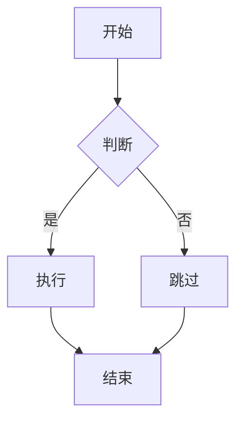

# Markdown 语法详解

## 1. 标题 (Headings)

```markdown
# 一级标题
## 二级标题
### 三级标题
#### 四级标题
##### 五级标题
###### 六级标题

# 另一种写法：一级标题
==================
## 另一种写法：二级标题
------------------
```

**效果**：
# 一级标题
## 二级标题
### 三级标题

---

## 2. 文本样式

```markdown
*斜体* 或 _斜体_
**粗体** 或 __粗体__
***粗斜体*** 或 ___粗斜体___

~~删除线~~

==高亮== (部分解析器支持)
```

**效果**：
*斜体*
**粗体**
***粗斜体***
~~删除线~~

---

## 3. 列表

### 无序列表

```markdown
* 项目一
* 项目二
  * 子项目 2.1
  * 子项目 2.2
* 项目三

# 或使用 - 或 +
- 项目一
- 项目二
+ 项目三
```

**效果**：
* 项目一
* 项目二
  * 子项目 2.1
  * 子项目 2.2
* 项目三

### 有序列表

```markdown
1. 第一项
2. 第二项
3. 第三项
   1. 子项 3.1
   2. 子项 3.2

# 自动序号
1. 第一项
1. 第二项
5. 第三项  # 会显示为 3.
```

**效果**：
1. 第一项
2. 第二项
3. 第三项
   1. 子项 3.1
   2. 子项 3.2

### 任务列表

```markdown
- [x] 已完成的任务
- [ ] 未完成的任务
- [ ] 待办事项
```

**效果**：
- [x] 已完成的任务
- [ ] 未完成的任务
- [ ] 待办事项

---

## 4. 链接 (Links)

```markdown
# 行内链接
[链接文本](https://example.com)
[带标题的链接](https://example.com "鼠标悬停提示")

# 相对路径
[查看详情](./docs/README.md)

# 引用链接
[引用式链接][link-reference]
[link-reference]: https://example.com "可选标题"

# 邮箱链接
<email@example.com>

# 自动链接
<https://example.com>
```

**效果**：
[链接文本](https://example.com)
[带标题的链接](https://example.com "鼠标悬停提示")
<email@example.com>
<https://example.com>

---

## 5. 图片 (Images)

```markdown
# 行内图片


# 相对路径


# 引用式图片
![引用式图片][image-ref]
[image-ref]: ./images/photo.jpg "图片说明"

# 指定尺寸（HTML）

```

---

## 6. 引用 (Blockquotes)

```markdown
# 单行引用
> 这是一段引用

# 多行引用
> 第一行
> 第二行
> 第三行

# 嵌套引用
> 外层引用
>> 内层引用
>>> 更深层引用

# 引用中包含其他元素
> ### 标题
>
> - 列表项
> - 另一个列表项
>
> 普通段落
```

**效果**：
> 这是一段引用
>
>> 嵌套引用

---

## 7. 代码 (Code)

### 行内代码

```markdown
使用 `反引号` 包裹代码
```

**效果**：使用 `反引号` 包裹代码

### 代码块

````markdown
# 三个反引号包裹，可指定语言
```javascript
function hello() {
  console.log("Hello, World!");
}
```

# 缩进方式（4个空格或1个Tab）
    function hello() {
      console.log("Hello");
    }
````

**效果**：
```javascript
function hello() {
  console.log("Hello, World!");
}
```

### 常用语言标识

| 语言 | 标识 | 语言 | 标识 |
|------|------|------|------|
| JavaScript | `javascript` / `js` | Python | `python` / `py` |
| HTML | `html` | CSS | `css` |
| Java | `java` | C++ | `cpp` |
| Go | `go` | Rust | `rust` |
| SQL | `sql` | Bash | `bash` / `shell` |
| JSON | `json` | YAML | `yaml` |

---

## 8. 分隔线 (Horizontal Rules)

```markdown
***

---

___

# 以上三种写法效果相同
```

---

## 9. 表格 (Tables)

```markdown
| 左对齐 | 居中对齐 | 右对齐 |
| :----- | :------: | ------: |
| 内容1  |  内容2   |  内容3  |
| 左边   |  中间    |   右边  |

# 简化写法（不需要对齐）
| 列1 | 列2 | 列3 |
|-----|-----|-----|
| A   | B   | C   |

# 表格内使用其他语法
| 列1 | 列2 | 列3 |
|-----|-----|-----|
| **粗体** | `代码` | [链接](#) |
```

**效果**：

| 左对齐 | 居中对齐 | 右对齐 |
| :----- | :------: | ------: |
| 内容1  |  内容2   |  内容3  |
| 左边   |  中间    |   右边  |

---

## 10. 转义字符 (Escaping)

```markdown
# 使用反斜杠转义特殊字符
\* 不是斜体 \*
\[ 不是链接 \[
\` 不是代码 \`

# 可转义的字符
\   反斜杠
`   反引号
*   星号
_   下划线
{}  花括号
[]  方括号
()  圆括号
#   井号
+   加号
-   减号
.   点号
!   感叹号
```

---

## 11. HTML 支持

```markdown
# Markdown 支持嵌入 HTML
<div style="color: red;">红色文字</div>

<details>
  <summary>点击展开</summary>
  这是隐藏的内容
</details>

<!-- HTML 注释 -->
```

**效果**：

```html
<div style="color: red;">红色文字</div>

<details>
  <summary>点击展开</summary>
  这是隐藏的内容
</details>
```

---

## 12. 脚注 (Footnotes)

```markdown
这是一段文字[^1]，这里有另一个脚注[^note]。

[^1]: 这是第一个脚注的说明
[^note]: 这是另一个脚注，可以包含多行内容
     第二行内容
```

**效果**：
这是一段文字[^1]，这里有另一个脚注[^note]。

[^1]: 这是第一个脚注的说明
[^note]: 这是另一个脚注，可以包含多行内容

---

## 13. 锚点链接 (Anchor Links)

```markdown
# 跳转到页面内的标题
[回到顶部](#markdown-语法详解)
[跳转到代码章节](#6-代码-code)
```

**效果**：
[回到顶部](#markdown-语法详解)

---

## 14. 数学公式 (Math)

### 行内公式

```markdown
$E = mc^2$
```

**效果**：$E = mc^2$

### 块级公式

```markdown
$$
\frac{-b \pm \sqrt{b^2 - 4ac}}{2a}
$$
```

**效果**：
$$
\frac{-b \pm \sqrt{b^2 - 4ac}}{2a}
$$

### 常用数学符号

| 符号 | 语法 | 符号 | 语法 |
|------|------|------|------|
| α | `\alpha` | β | `\beta` |
| Σ | `\Sigma` | Π | `\Pi` |
| √ | `\sqrt{}` | ∫ | `\int` |
| → | `\rightarrow` | ⇔ | `\Leftrightarrow` |
| ∈ | `\in` | ∪ | `\cup` |

---

## 15. 流程图/图表 (Mermaid)

```markdown

```

**效果**：


---

## 16. Emoji 表情

```markdown
# 方式一：使用 emoji 代码
:smile: :heart: :thumbsup:

# 方式二：直接输入 emoji（取决于编辑器支持）
😊 ❤️ 👍
```

**常用 Emoji 代码**：

| 代码 | Emoji | 代码 | Emoji |
|------|-------|------|-------|
| `:smile:` | 😄 | `:laughing:` | 😆 |
| `:heart:` | ❤️ | `:broken_heart:` | 💔 |
| `:thumbsup:` | 👍 | `:thumbsdown:` | 👎 |
| `:fire:` | 🔥 | `:star:` | ⭐ |
| `:check_mark:` | ✅ | `:x:` | ❌ |
| `:warning:` | ⚠️ | `:memo:` | 📝 |

---

## 17. 定义列表 (Definition Lists)

```markdown
术语 1
:   定义 1
:   定义 1 的补充说明

术语 2
:   定义 2
```

**效果**（部分解析器支持）：
术语 1
:   定义 1

术语 2
:   定义 2

---

## 18. 快捷键提示 (Keyboard)

```markdown
# 使用 <kbd> 标签
按 <kbd>Ctrl</kbd> + <kbd>C</kbd> 复制
按 <kbd>⌘</kbd> + <kbd>S</kbd> 保存
```

**效果**：
按 <kbd>Ctrl</kbd> + <kbd>C</kbd> 复制

---

## 19. 折叠块 (Details)

````markdown
<details>
<summary>点击查看代码</summary>

```javascript
console.log("隐藏的代码");
```

</details>
````

**效果**：

````html
<details>
<summary>点击查看代码</summary>

```javascript
console.log("隐藏的代码");
```

</details>
````

---

## 20. GitHub Flavored Markdown (GFM) 扩展

### 任务列表

```markdown
- [x] 完成的任务
- [ ] 待办任务
```

### 表格

```markdown
| 列1 | 列2 |
|-----|-----|
| A   | B   |
```

### 自动链接

```markdown
https://github.com 自动转换为链接
```

### 删除线

```markdown
~~删除的内容~~
```

### 语法高亮

```markdown
```javascript
代码高亮
```
```

---

## 21. Markdown 最佳实践

### ✅ 推荐做法

```markdown
# 标题与正文之间空一行

## 列表前后空行
- 列表项1
- 列表项2

段落结束后空一行再开始下一个内容
```

### ❌ 避免的做法

```markdown
## 标题后面直接跟内容
内容会连在一起
- 列表没有空行
可能导致解析错误
```

### 命名规范

```markdown
# 文件名推荐使用小写 + 连字符
my-document.md
user-guide.md

# 避免使用空格和特殊字符
```

---

## 22. 常用 Markdown 编辑器

| 编辑器 | 平台 | 特点 |
|--------|------|------|
| VS Code | 全平台 | 插件丰富，支持预览 |
| Typora | 全平台 | 所见即所得 |
| Obsidian | 全平台 | 双向链接，知识管理 |
| Mark Text | 全平台 | 开源免费 |
| Notion | 全平台 | 笔记 + Markdown |
| GitHub Web | Web | 在线编辑，版本控制 |

---

## 23. 快速参考

| 语法 | 效果 |
|------|------|
| `# 标题` | 一级标题 |
| `## 标题` | 二级标题 |
| `*斜体*` | *斜体* |
| `**粗体**` | **粗体** |
| `~~删除~~` | ~~删除~~ |
| `[链接](url)` | [链接](url) |
| `` | 图片 |
| `> 引用` | > 引用 |
| `` `代码` `` | `代码` |
| `- 列表` | • 列表 |
| `1. 列表` | 1. 列表 |
| `---` | 分隔线 |
| `\| 表格 \|` | 表格 |

---

## 24. 注意事项

1. **空格很重要**：列表、引用等语法前后需要空行
2. **转义字符**：特殊字符前加 `\` 可转义
3. **兼容性**：不同解析器支持程度不同
4. **HTML 混用**：复杂布局建议用 HTML
5. **编码问题**：确保文件保存为 UTF-8 编码
