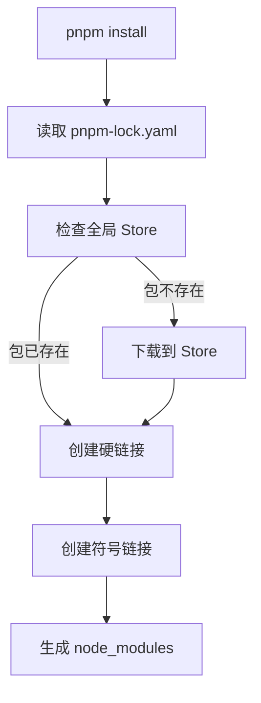

# pnpm 详解

## 目录

- [什么是 pnpm](#什么是-pnpm)
- [核心原理](#核心原理)
- [安装与使用](#安装与使用)
- [配置说明](#配置说明)
- [常见命令](#常见命令)
- [Monorepo 实战](#monorepo-实战)
- [最佳实践](#最佳实践)
- [高级特性](#高级特性)
- [常见问题](#常见问题)

---

## 什么是 pnpm

[pnpm](https://pnpm.io/zh/) 是一款快速、节省磁盘空间的**高效包管理器**，于 2017 年发布。它是 Node.js 生态中 npm 和 yarn 的替代方案，通过独特的硬链接和符号链接机制，实现了更快的安装速度和更高的磁盘空间利用率。

### 为什么选择 pnpm？

```
┌─────────────────────────────────────────────────────────────┐
│  传统 npm/yarn 问题                                         │
├─────────────────────────────────────────────────────────────┤
│  ❌ node_modules 体积巨大                                   │
│  ❌ 安装速度慢，项目越大越明显                               │
│  ❌ 幽灵依赖导致隐式依赖                                     │
│  ❌ 磁盘空间浪费（每个项目重复存储）                         │
└─────────────────────────────────────────────────────────────┘

┌─────────────────────────────────────────────────────────────┐
│  pnpm 解决方案                                              │
├─────────────────────────────────────────────────────────────┤
│  ✅ 硬链接共享，节省 50%+ 磁盘空间                           │
│  ✅ 并行安装，速度提升 2-3 倍                                │
│  ✅ 严格的依赖隔离，杜绝幽灵依赖                             │
│  ✅ 内容寻址存储，全局共享依赖                               │
└─────────────────────────────────────────────────────────────┘
```

### 核心优势对比

| 特性 | pnpm | npm | yarn (v1/v2+) | bun |
|------|------|-----|---------------|-----|
| 安装速度 | ⚡⚡⚡ 最快 | 🐢 较慢 | 🚀🚀 快 | ⚡⚡⚡ 极快 |
| 磁盘占用 | 💾 极省 | 💿💿 大量 | 💿💿 较大 | 💾 较省 |
| 幽灵依赖 | ❌ 无 | ✅ 有 | ✅ 有 | ❌ 无 |
| 严格的依赖管理 | ✅ | ❌ | ⚠️ 可选 | ✅ |
| Monorepo 支持 | ✅ 原生 | ❌ | ⚠️ 需插件 | ✅ 原生 |
| 符号链接 | ✅ 完整支持 | ⚠️ 部分 | ⚠️ 部分 | ✅ |

---

## 核心原理

### 1. 硬链接与符号链接

pnpm 的核心创新在于使用**硬链接**和**符号链接**来共享依赖：

```
项目结构示例：
my-project/
├── node_modules/
│   ├── .pnpm/                              # 依赖真实存储位置
│   │   └── lodash@4.17.21/
│   │       └── node_modules/
│   │           └── lodash/                 ← 真实文件（硬链接自 store）
│   │               └── index.js
│   ├── .pnpm/axios@1.6.0_node_modules/
│   │   └── node_modules/
│   │       ├── axios/                      ← 真实文件
│   │       └── follow-redirects/           ← axios 的依赖
│   └── lodash  ← 符号链接 → .pnpm/lodash@4.17.21/node_modules/lodash
│   └── axios  ← 符号链接 → .pnpm/axios@1.6.0_.../node_modules/axios
└── package.json
```

**工作流程：**



### 2. 为什么节省空间？

```
传统 npm（3个项目，每个都安装 lodash@4.17.21，约 70KB）：

项目 A/node_modules/lodash/     → 70KB 独立副本
项目 B/node_modules/lodash/     → 70KB 独立副本
项目 C/node_modules/lodash/     → 70KB 独立副本
────────────────────────────────────────
总计：210KB

pnpm（3个项目）：

~/.pnpm-store/v3/files/        → 70KB 存储一份
└── lodash/4.17.21/
    ├── 项目 A/.pnpm/.../       → 硬链接（几乎 0KB）
    ├── 项目 B/.pnpm/.../       → 硬链接（几乎 0KB）
    └── 项目 C/.pnpm/.../       → 硬链接（几乎 0KB）
────────────────────────────────────────
总计：70KB（节省 66%+）

实际项目场景：
100 个项目，node_modules 平均 500MB
npm/yarn: 50GB 磁盘占用
pnpm:    ~1GB 磁盘占用（节省 98%）
```

### 3. 内容寻址存储

pnpm 使用内容寻址而非包名寻址：

```bash
# 传统方式（npm/yarn）- 按包名扁平化
node_modules/
├── lodash/
├── axios/
└── express/

# pnpm 方式 - 内容寻址，完全隔离
node_modules/
└── .pnpm/
    ├── lodash@4.17.21_node_modules@lodash/
    │   └── node_modules/
    │       └── lodash/
    ├── axios@1.6.0_node_modules@axios/
    │   └── node_modules/
    │       ├── axios/
    │       └── follow-redirects@1.15.0/  # axios 的依赖，隔离存储
    └── express@4.18.0_node_modules@express/
        └── node_modules/
            └── express/
```

**内容寻址的优点：**

| 优点 | 说明 |
|------|------|
| 版本隔离 | 同一包的不同版本完全隔离，互不干扰 |
| 去重存储 | 不同包依赖的同一版本共享存储 |
| 依赖安全 | 杜绝隐式依赖访问，代码更可预测 |
| 快速安装 | 已有包直接硬链接，无需复制 |

### 4. 依赖解析机制

```javascript
// package.json
{
  "dependencies": {
    "axios": "^1.6.0"          // 你声明的依赖 ✅
  },
  "devDependencies": {
    "eslint": "^8.0.0"         // 开发依赖 ✅
  }
}

// 假设 axios 依赖 follow-redirects
// pnpm 的依赖结构：
node_modules/
├── axios          ← 可以直接访问 ✅
│   └── node_modules/
│       └── follow-redirects  ← axios 可以访问，你访问不到 ❌
└── eslint         ← 可以直接访问 ✅

// npm 的依赖结构（提升机制）：
node_modules/
├── axios
├── follow-redirects  ← 被提升，你也可以访问 ⚠️ 幽灵依赖！
└── eslint
```

---

## 安装与使用

### 全局安装

```bash
# 方式一：使用 npm 安装
npm install -g pnpm

# 方式二：使用 Homebrew（macOS/Linux）
brew install pnpm
brew upgrade pnpm  # 升级

# 方式三：使用 Scoop（Windows）
scoop install pnpm
scoop update pnpm  # 升级

# 方式四：使用自安装脚本（推荐）
curl -fsSL https://get.pnpm.io/install.sh | sh -

# 方式五：使用 Docker
docker run -it --rm node:18 bash -c "npm i -g pnpm && pnpm -v"
```

### 验证安装

```bash
pnpm --version
# 输出：9.15.1

pnpm --help
# 查看完整帮助信息
```

### Node.js 版本管理

```bash
# pnpm 内置 Node.js 版本管理器
pnpm env use --global lts     # 使用最新 LTS 版本
pnpm env use --global 18      # 使用 Node.js 18
pnpm env list                 # 列出已安装的版本
pnpm env remove --global 16   # 移除指定版本
```

---

## 配置说明

### .npmrc 配置文件

pnpm 支持多层级配置，优先级从高到低：

```
项目 .npmrc > 用户 ~/.npmrc > 全局 /etc/npmrc
```

#### 常用配置项

```ini
# .npmrc

# ============================================
# 依赖管理
# ============================================

# 严格检查 peerDependencies（推荐开启）
strict-peer-dependencies=true

# 自动安装 peerDependencies
auto-install-peers=true

# 提升所有依赖到根 node_modules（不推荐，会失去 pnpm 优势）
# shamefully-hoist=true

# 选择性提升特定包
public-hoist-pattern[]=*eslint*
public-hoist-pattern[]=*prettier*
public-hoist-pattern[]=*webpack*

# ============================================
# 存储配置
# ============================================

# 全局存储位置（默认：~/.pnpm-store）
store-dir=/path/to/store

# 虚拟存储位置（默认：node_modules/.pnpm）
virtual-store-dir=node_modules/.pnpm

# ============================================
# 网络与源
# ============================================

# 注册源
registry=https://registry.npmmirror.com

# 单个包的源
@babel:registry=https://registry.npmjs.org/
@vue:registry=https://registry.npmmirror.com

# ============================================
# 性能优化
# ============================================

# 并发下载数（默认：4）
network-concurrency=16

# 纯哈希校验速度更快但占用内存
prefer-offline=true

# ============================================
# 其他
# ============================================

# 锁文件格式
lockfile-format=v6

# 忽略 package.json 扩展字段
ignore-scripts=false

# 不生成 package-lock.json
package-lock-only=false
```

#### 环境变量

```bash
# 设置国内镜像
export PNPM_REGISTRY=https://registry.npmmirror.com

# 设置存储位置
export PNPM_STORE_DIR=/data/pnpm-store

# 禁用进度条
export CI=true
```

### pnpm-workspace.yaml

**完整工作区配置**：

```yaml
# pnpm-workspace.yaml

packages:
  # 通配符匹配
  - 'packages/*'
  - 'apps/*'
  - 'tools/**'

  # 排除特定目录
  - '!**/test'
  - '!**/__tests__'

  # 精确匹配
  - 'shared'
```

**典型 Monorepo 结构**：

```
my-monorepo/
├── pnpm-workspace.yaml
├── package.json
├── .npmrc
├── pnpm-lock.yaml
│
├── packages/
│   ├── shared/                    # 共享工具库
│   │   ├── package.json           # { "name": "@monorepo/shared" }
│   │   └── src/
│   │       └── utils.ts
│   │
│   ├── ui/                        # UI 组件库
│   │   ├── package.json           # { "name": "@monorepo/ui" }
│   │   └── src/
│   │       └── Button.vue
│   │
│   └── config/                    # 配置包
│       └── package.json           # { "name": "@monorepo/config" }
│
├── apps/
│   ├── web/                       # Web 应用
│   │   ├── package.json           # 依赖 @monorepo/shared, @monorepo/ui
│   │   └── src/
│   │       └── main.ts
│   │
│   └── admin/                     # 管理后台
│       ├── package.json
│       └── src/
│           └── admin.ts
│
└── tools/
    └── script/                    # 构建脚本
        └── package.json
```

### pnpmfile.js

通过 `pnpmfile.js` 可以自定义包安装行为：

```javascript
// .pnpmfile.js
const { hooks } = require('@pnpm/fnppm')

module.exports = {
  hooks: {
    // 读取包信息后触发
    readPackage(pkg, context) {
      // 修改依赖版本
      if (pkg.dependencies && pkg.dependencies.react) {
        pkg.dependencies.react = '^18.0.0'
      }

      // 添加依赖
      if (pkg.name === '@monorepo/app') {
        pkg.dependencies = pkg.dependencies || {}
        pkg.dependencies.source-map-support = 'latest'
      }

      return pkg
    },

    // 包被添加到项目后触发
    afterAllInstalled(lockfile, context) {
      console.log('All packages installed!')
    }
  },

  // 包别名
  aliases: {
    // 将 vue 安装为 'vue2'
    'vue2': 'npm:vue@2',
  },

  // 包重定向
  packageExtensions: {
    'some-package': {
      peers: {
        'react': '*'
      }
    }
  }
}
```

---

## 常见命令

### 基础命令

```bash
# ============================================
# 项目初始化
# ============================================
pnpm init                      # 创建 package.json
pnpm init -y                   # 跳过询问

# ============================================
# 依赖安装
# ============================================
pnpm install                   # 安装所有依赖
pnpm install --prod            # 只安装 dependencies
pnpm install --dev             # 只安装 devDependencies

pnpm add <package>             # 添加到 dependencies
pnpm add -D <package>          # 添加到 devDependencies
pnpm add -O <package>          # 添加到 optionalDependencies
pnpm add -g <package>          # 全局安装

pnpm add <package>@next        # 安装 next tag 版本
pnpm add <package>@beta        # 安装 beta 版本
pnpm add <package> --tag=next  # 指定 tag

pnpm add <package> --save-exact      # 精确版本（不带 ^）
pnpm add <package> -E                # 同上（简写）

# ============================================
# 依赖管理
# ============================================
pnpm remove <package>          # 卸载依赖
pnpm remove -g <package>       # 卸载全局依赖

pnpm update                    # 更新所有依赖（遵循 package.json）
pnpm update <package>          # 更新指定包
pnpm update --latest           # 更新到最新版本（忽略 package.json）
pnpm update --interactive      # 交互式选择更新

pnpm outdated                  # 列出可更新的包

# ============================================
# 信息查看
# ============================================
pnpm list                      # 列出所有依赖
pnpm list --depth=0            # 只列出顶层依赖
pnpm list --prod               # 只列出 dependencies
pnpm list --long               # 显示详细信息

pnpm why <package>             # 查看包为何被安装

pnpm info <package>            # 查看包信息
pnpm info <package> versions   # 查看所有版本
pnpm view <package>            # 同 info

pnpm licenses list             # 列出所有许可证
pnpm licenses generate-dispute # 生成许可证争议报告

# ============================================
# 脚本执行
# ============================================
pnpm run <script>              # 运行脚本
pnpm run                       # 列出所有脚本
pnpm run --parallel <script>   # 并行运行（workspace）

pnpm exec <command>            # 执行命令
pnpm dlx <package>             # 临时下载并执行（不安装）
pnpm create <template> <app>   # 创建项目（如 pnpm create vite）
```

### Store 管理命令

```bash
# ============================================
# Store 管理
# ============================================
pnpm store status              # 查看状态
pnpm store path                # 查看 store 路径
pnpm store add <package>       # 添加包到 store
pnpm store prune               # 清理未引用的包
pnpm store shrinkwrap          # 将 store 打包成 pnpm-store.tar.gz

# 离线模式
pnpm install --offline         # 仅使用缓存，不联网
pnpm install --prefer-offline  # 优先使用缓存

# 忽略缓存
pnpm install --force           # 重新下载所有包
pnpm install --no-frozen-lockfile  # 更新 lockfile
```

### Monorepo 命令

```bash
# ============================================
# Workspace 命令
# ============================================
# 在所有包中执行
pnpm -r install                # 所有工作区安装依赖
pnpm -r run build              # 所有工作区运行 build
pnpm -r run test               # 所有工作区运行 test
pnpm -r exec rm -rf dist       # 所有工作区执行命令

# --workspace 是 -r 的别名
pnpm -w install                # 安装根目录依赖

# 过滤执行
pnpm --filter <pattern> <cmd>  # 只在匹配的包中执行
pnpm --filter ./packages/* build
pnpm --filter @monorepo/web test

# 按依赖关系执行
pnpm --filter "@monorepo/ui^..." run build  # 构建 ui 及其依赖

# 工作区内部依赖
pnpm add <workspace-name> --workspace  # 添加工作区依赖

# 查看依赖关系
pnpm -r list --depth=0         # 列出所有工作区

# 发布所有包
pnpm -r publish
pnpm -r publish --access public
```

---

## Monorepo 实战

### 创建 Monorepo 项目

```bash
# 1. 创建项目目录
mkdir my-monorepo && cd my-monorepo

# 2. 初始化
pnpm init

# 3. 创建 workspace 配置
cat > pnpm-workspace.yaml << 'EOF'
packages:
  - 'packages/*'
  - 'apps/*'
EOF

# 4. 创建目录结构
mkdir -p packages/shared apps/web

# 5. 初始化子包
cd packages/shared && pnpm init
cd ../..
cd apps/web && pnpm init
cd ../..

# 6. 安装依赖
pnpm install
```

### 子包之间引用

```json
// packages/shared/package.json
{
  "name": "@monorepo/shared",
  "version": "1.0.0",
  "type": "module",
  "main": "./dist/index.js",
  "module": "./dist/index.js",
  "types": "./dist/index.d.ts",
  "exports": {
    ".": {
      "import": "./dist/index.js",
      "types": "./dist/index.d.ts"
    },
    "./utils": {
      "import": "./dist/utils.js"
    }
  }
}
```

```json
// apps/web/package.json
{
  "name": "@monorepo/web",
  "version": "1.0.0",
  "dependencies": {
    "@monorepo/shared": "workspace:*",      // 引用工作区包
    "@monorepo/shared": "workspace:^",      // 带范围
    "vue": "^3.4.0"
  },
  "devDependencies": {
    "vite": "^5.0.0"
  }
}
```

### Filter 高级用法

```bash
# ============================================
# Filter 语法
# ============================================

# 1. 包名匹配
pnpm --filter @monorepo/web run dev

# 2. 目录匹配
pnpm --filter ./packages/ui run build

# 3. 通配符
pnpm --filter "./packages/*" run lint

# 4. 依赖关系（... 表示依赖）
pnpm --filter "@monorepo/app..." run build
# 构建 app 及其所有依赖的包

# 5. 被依赖关系（^... 表示被依赖）
pnpm --filter "@monorepo/shared^..." run test
# 在依赖 shared 的所有包中执行

# 6. 组合使用
pnpm --filter "@monorepo/ui..." --filter "!@monorepo/ui" run build
# 构建依赖 ui 的包，但不包含 ui 本身

# 7. 多个过滤
pnpm --filter "./apps/*" --filter "./packages/ui" run build
```

### 依赖管理最佳实践

```json
// 根目录 package.json
{
  "name": "my-monorepo",
  "private": true,
  "scripts": {
    "build": "pnpm -r --filter './packages/*' build",
    "dev": "pnpm -r --parallel --filter './apps/*' dev",
    "lint": "pnpm -r run lint",
    "clean": "pnpm -r exec rm -rf dist node_modules"
  },
  "devDependencies": {
    "typescript": "^5.3.0",
    "vite": "^5.0.0",
    "eslint": "^8.56.0",
    "prettier": "^3.1.0"
  },
  "pnpm": {
    "overrides": {
      // 统一版本，确保所有子包使用相同版本
      "typescript": "^5.3.0",
      "vite": "^5.0.0"
    }
  }
}
```

---

## 最佳实践

### 1. 强制使用 pnpm

防止团队成员误用 npm/yarn：

```json
// package.json
{
  "scripts": {
    "preinstall": "npx only-allow pnpm"
  }
}
```

或使用 `.npmrc`：

```ini
# .npmrc
engine-strict=true
```

```json
// package.json
{
  "engines": {
    "node": ">=18.0.0",
    "pnpm": ">=8.0.0"
  }
}
```

### 2. 严格的依赖配置

```ini
# .npmrc

# 严格 peer 依赖检查
strict-peer-dependencies=true

# 不自动安装缺失的 peer 依赖
# auto-install-peers=false

# 选择性提升（解决兼容性问题）
public-hoist-pattern[]=*eslint*
public-hoist-pattern[]=*prettier*
public-hoist-pattern[]=*vite*
public-hoist-pattern[]=@types/*
```

### 3. 统一版本管理

```json
// package.json
{
  "pnpm": {
    "overrides": {
      // 强制所有子包使用相同版本
      "react": "^18.2.0",
      "react-dom": "^18.2.0",
      "lodash": "^4.17.21"
    },
    "packageExtensions": {
      // 补充缺失的 peer 依赖声明
      "some-package": {
        "peerDependencies": {
          "react": "*"
        }
      }
    }
  }
}
```

### 4. 缓存策略

```bash
# CI 环境配置
# .github/workflows/ci.yml

- name: Setup pnpm
  uses: pnpm/action-setup@v2
  with:
    version: 8
- name: Get pnpm store directory
  id: pnpm-cache
  shell: bash
  run: |
    echo "STORE_PATH=$(pnpm store path)" >> $GITHUB_OUTPUT
- name: Setup pnpm cache
  uses: actions/cache@v3
  with:
    path: ${{ steps.pnpm-cache.outputs.STORE_PATH }}
    key: ${{ runner.os }}-pnpm-store-${{ hashFiles('**/pnpm-lock.yaml') }}
    restore-keys: |
      ${{ runner.os }}-pnpm-store-
```

### 5. 开发脚本优化

```json
// package.json
{
  "scripts": {
    // 基础
    "dev": "vite",
    "build": "vite build",
    "preview": "vite preview",
    "test": "vitest",

    // Monorepo
    "dev:all": "pnpm -r --parallel --filter './apps/*' dev",
    "build:all": "pnpm -r --filter './packages/*' build && pnpm -r --filter './apps/*' build",

    // 清理
    "clean": "rm -rf node_modules dist",
    "clean:all": "pnpm -r exec rm -rf node_modules dist && rm -rf node_modules",

    // 代码质量
    "lint": "eslint . --ext .ts,.vue",
    "lint:fix": "eslint . --ext .ts,.vue --fix",
    "format": "prettier --write .",

    // 依赖
    "deps:check": "pnpm outdated",
    "deps:update": "pnpm update --latest",
    "deps:dedupe": "pnpm dedupe"
  }
}
```

---

## 高级特性

### 1. pnpm Exec 与 dlx

```bash
# pnpm exec - 执行已安装的包的二进制文件
pnpm exec vite               # 相当于 ./node_modules/.bin/vite
pnpm exec tsc --version      # 执行本地 typescript

# pnpm dlx - 临时下载并执行（不安装到项目）
pnpm dlx create-vite my-app  # 创建项目，不全局安装
pnpm dlx prettier --write .  # 临时格式化

# 与 npx 的区别
npx create-vite my-app       # 可能使用缓存的旧版本
pnpm dlx create-vite my-app  # 始终使用最新版本
```

### 2. State 过滤器

```bash
# 只执行在特定状态的包
pnpm -r --filter "...(dev)" run test    # 只在 devDependencies 包中
pnpm -r --filter "...(prod)" run build  # 只在 dependencies 包中
```

### 3. 并行与串行执行

```bash
# 并行执行所有包（默认）
pnpm -r run build

# 串行执行（拓扑排序，依赖先执行）
pnpm -r --workspace-concurrency=1 run build

# 限制并发数
pnpm -r --workspace-concurrency=2 run build
```

### 4. 增量构建

```bash
# 结合 Turbo 等工具实现增量构建
pnpm add -D turbo

# turbo.json
{
  "pipeline": {
    "build": {
      "dependsOn": ["^build"],
      "outputs": ["dist/**"]
    }
  }
}

# 执行
pnpm build  # 只构建改动的包及其依赖
```

### 5. pnpm-link

```bash
# 链接本地开发的包
# 在包 A 中
cd packages/a
pnpm link --global

# 在包 B 中
cd packages/b
pnpm link --global @monorepo/a

# 使用 workspace 替代（推荐）
# packages/b/package.json
{
  "dependencies": {
    "@monorepo/a": "workspace:*"
  }
}
```

---

## 常见问题

### Q1: 幽灵依赖问题

**问题描述**：npm/yarn 会提升依赖，导致项目可以访问未在 package.json 中声明的依赖。

```javascript
// 假设：项目 → A → B → C
// npm/yarn 结构
node_modules/
├── A/
├── B/
└── C/  ← 被提升，你的代码可以直接 require('C') ⚠️

// pnpm 结构
node_modules/
└── A/
    └── node_modules/
        └── B/
            └── node_modules/
                └── C/  ← 只有 B 能访问 C
```

**pnpm 的优势**：
- ✅ 代码更安全，不会意外使用未声明的依赖
- ✅ 依赖关系清晰，便于维护
- ✅ 包作者可以放心修改依赖，不影响使用者

**如何适配**：
```javascript
// ❌ 错误：直接使用幽灵依赖
import flatten from 'flatten'  // 未声明

// ✅ 正确：显式声明
// package.json
{
  "dependencies": {
    "flatten": "^1.0.0"
  }
}
import flatten from 'flatten'
```

### Q2: 符号链接兼容性问题

**问题工具**：某些工具不兼容符号链接，导致错误。

```bash
Error: ENOENT: no such file or directory
```

**解决方案**：

```ini
# .npmrc

# 方案一：完全提升（不推荐）
# shamefully-hoist=true

# 方案二：选择性提升（推荐）
public-hoist-pattern[]=*eslint*
public-hoist-pattern[]=*prettier*
public-hoist-pattern[]=*webpack*
public-hoist-pattern[]=*vite*
public-hoist-pattern[]=@types/*

# 方案三：提升所有以 @ 开头的包
public-hoist-pattern[]=*@*
```

### Q3: 国内镜像配置

```bash
# 方式一：永久配置
pnpm config set registry https://registry.npmmirror.com

# 方式二：项目级 .npmrc
echo "registry=https://registry.npmmirror.com" >> .npmrc

# 方式三：环境变量
export PNPM_REGISTRY=https://registry.npmmirror.com

# 方式四：使用 .npmrc 配置文件
# ~/.npmrc
registry=https://registry.npmmirror.com
@babel:registry=https://registry.npmjs.org/
@vue:registry=https://registry.npmmirror.com

# 验证
pnpm config get registry
```

### Q4: CI 环境配置

```yaml
# .github/workflows/ci.yml
name: CI

on: [push, pull_request]

jobs:
  build:
    runs-on: ubuntu-latest
    steps:
      - uses: actions/checkout@v4

      - name: Setup Node.js
        uses: actions/setup-node@v4
        with:
          node-version: '18'

      - name: Setup pnpm
        uses: pnpm/action-setup@v2
        with:
          version: 8

      - name: Get pnpm store directory
        id: pnpm-cache
        run: echo "STORE_PATH=$(pnpm store path)" >> $GITHUB_OUTPUT

      - name: Setup pnpm cache
        uses: actions/cache@v3
        with:
          path: ${{ steps.pnpm-cache.outputs.STORE_PATH }}
          key: ${{ runner.os }}-pnpm-store-${{ hashFiles('**/pnpm-lock.yaml') }}
          restore-keys: |
            ${{ runner.os }}-pnpm-store-

      - name: Install dependencies
        run: pnpm install --frozen-lockfile

      - name: Run tests
        run: pnpm test

      - name: Build
        run: pnpm build
```

### Q5: Docker 中使用 pnpm

```dockerfile
# Dockerfile
FROM node:18-alpine

# 安装 pnpm
RUN npm install -g pnpm

# 设置工作目录
WORKDIR /app

# 复制 lockfile
COPY pnpm-lock.yaml package.json ./

# 安装依赖
RUN pnpm install --frozen-lockfile

# 复制源码
COPY . .

# 构建应用
RUN pnpm build

# 启动应用
CMD ["pnpm", "start"]
```

```dockerfile
# 多阶段构建优化
FROM node:18-alpine AS builder
RUN npm install -g pnpm
WORKDIR /app
COPY pnpm-lock.yaml package.json ./
RUN pnpm install --frozen-lockfile
COPY . .
RUN pnpm build

FROM node:18-alpine AS runner
RUN npm install -g pnpm
WORKDIR /app
COPY --from=builder /app/dist ./dist
COPY package.json pnpm-lock.yaml ./
RUN pnpm install --prod --frozen-lockfile
CMD ["pnpm", "start"]
```

### Q6: 权限问题

```bash
# macOS/Linux 权限错误
Error: EACCES: permission denied

# 解决方案一：使用正确的 pnpm 存储位置
pnpm config set store-dir ~/.pnpm-store

# 解决方案二：修复权限
sudo chown -R $(whoami) ~/.pnpm-store

# 解决方案三：使用项目级 store
# .npmrc
store-dir=.pnpm-store
```

### Q7: 内存不足

```bash
# 大型项目可能出现内存不足
Error: CALL_AND_RETRY_LAST Allocation failed

# 解决方案：增加 Node.js 内存限制
pnpm run build --node-options=--max-old-space-size=4096

# 或在 package.json 中
{
  "scripts": {
    "build": "node --max-old-space-size=4096 ./node_modules/.bin/vite build"
  }
}
```

---

## 与其他工具对比

### 性能对比数据

```
测试环境：1000 个依赖的项目

┌────────────┬───────────┬──────────────┬─────────────┐
│            │ 安装时间   │ 磁盘占用     │  node_modules │
├────────────┼───────────┼──────────────┼─────────────┤
│ npm        │  120s     │  1.2 GB      │  1.2 GB     │
│ yarn v1    │   85s     │  1.1 GB      │  1.1 GB     │
│ yarn v2+   │   75s     │  300 MB      │  300 MB     │
│ pnpm       │   45s     │  250 MB      │  ~10 MB*    │
│ bun        │   20s     │  250 MB      │  250 MB     │
└────────────┴───────────┴──────────────┴─────────────┘

* pnpm 的 node_modules 只包含符号链接，实际文件在 store
```

### 迁移对照表

| 操作 | npm | yarn | pnpm | bun |
|------|-----|------|------|-----|
| 安装依赖 | `npm install` | `yarn` | `pnpm install` | `bun install` |
| 添加依赖 | `npm add` | `yarn add` | `pnpm add` | `bun add` |
| 添加开发依赖 | `npm add -D` | `yarn add -D` | `pnpm add -D` | `bun add -d` |
| 全局安装 | `npm add -g` | `yarn global add` | `pnpm add -g` | `bun add -g` |
| 卸载依赖 | `npm remove` | `yarn remove` | `pnpm remove` | `bun remove` |
| 更新依赖 | `npm update` | `yarn upgrade` | `pnpm update` | `bun update` |
| 运行脚本 | `npm run` | `yarn run` | `pnpm run` | `bun run` |
| 执行命令 | `npx` | `yarn dlx` | `pnpm dlx` | `bunx` |

### Lock 文件对比

```json
// package-lock.json (npm) - 嵌套结构，非常冗长
{
  "name": "my-app",
  "lockfileVersion": 2,
  "packages": {
    "node_modules/lodash": {
      "version": "4.17.21",
      "resolved": "https://registry.npmjs.org/lodash/-/lodash-4.17.21.tgz",
      "integrity": "sha512-..."
    }
  }
}

// yarn.lock - 文本格式，不保证顺序
# yarn lockfile v1
lodash@^4.17.21:
  version "4.17.21"
  resolved "https://registry.yarnpkg.com/lodash/-/lodash-4.17.21.tgz"
  integrity sha512-...

# pnpm-lock.yaml - YAML 格式，紧凑，依赖关系清晰
lockfileVersion: '6.0'
dependencies:
  lodash:
    specifier: ^4.17.21
    version: 4.17.21
packages:
  /lodash@4.17.21:
    resolution: {integrity: sha512-...}
    dev: false
```

---

## 总结

### pnpm 适用场景

| 场景 | 推荐度 | 说明 |
|------|--------|------|
| Monorepo 项目 | ⭐⭐⭐⭐⭐ | workspace 原生支持，依赖管理清晰 |
| CI/CD 环境 | ⭐⭐⭐⭐⭐ | 安装速度快，缓存友好 |
| 多项目开发 | ⭐⭐⭐⭐⭐ | 共享 store，节省磁盘空间 |
| 大型项目 | ⭐⭐⭐⭐⭐ | 安装速度优势明显 |
| 小型项目 | ⭐⭐⭐⭐ | 依然推荐，但优势不明显 |
| 需要幽灵依赖 | ⭐⭐ | 不推荐，可通过配置解决 |

### 核心优势回顾

```
┌────────────────────────────────────────────────────────┐
│  pnpm 核心优势                                          │
├────────────────────────────────────────────────────────┤
│  ⚡ 快速         比 npm 快 2-3 倍                      │
│  💾 节省空间     相比 npm 节省 50%+ 磁盘空间            │
│  🔒 严格依赖     杜绝幽灵依赖，代码更安全                │
│  📦 Monorepo     原生 workspace 支持                   │
│  🛠️ 功能完善     完整的包管理器功能                     │
└────────────────────────────────────────────────────────┘
```

### 学习资源

- 📚 [官方文档](https://pnpm.io/zh/) - 最权威的参考资料
- 📦 [GitHub 仓库](https://github.com/pnpm/pnpm) - 源码与 Issue
- 💬 [Discord 社区](https://discord.gg/pnpm) - 实时交流
- 🐦 [Twitter @pnpmjs](https://twitter.com/pnpmjs) - 最新动态

> 💡 **一句话总结**：pnpm 是当前 Node.js 生态中最优秀的包管理器之一，特别适合中大型项目和 Monorepo 架构。
