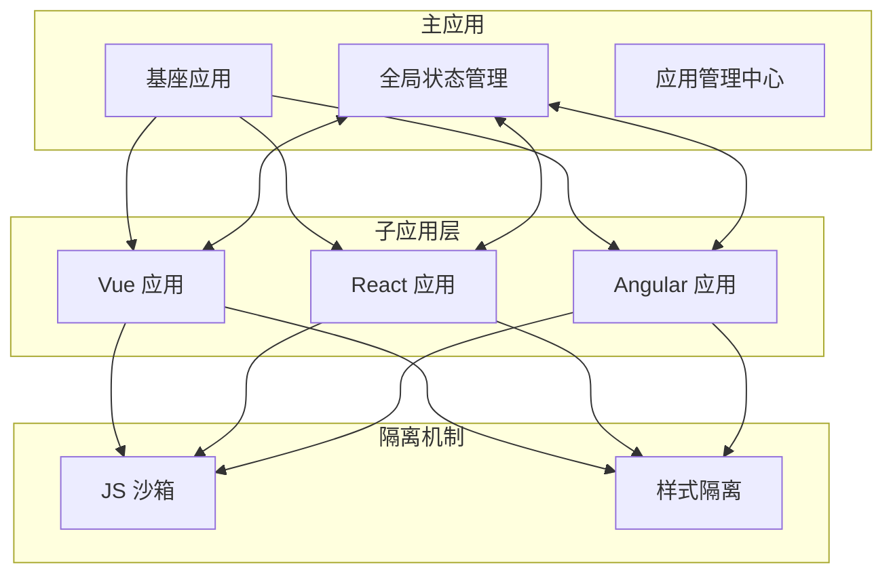
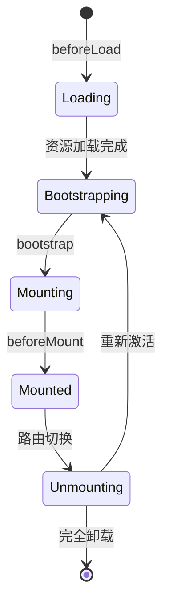

# qiankun 微前端框架

> qiankun 是阿里开源的基于 single-spa 的微前端框架，提供了开箱即用的微前端解决方案。

## 一、简介

[qiankun](https://qiankun.umijs.org/zh) 基于 [single-spa](https://single-spa.js.org/) 封装，解决了使用 single-spa 时的痛点，提供了更友好的 API 和更完善的隔离机制。

### 1.1 qiankun vs single-spa

| 特性 | single-spa | qiankun |
|------|-----------|---------|
| JS 沙箱 | 需手动实现 | ✅ ProxySandbox |
| 样式隔离 | 需手动处理 | ✅ Shadow DOM / Scoped CSS |
| 预加载 | 手动实现 | ✅ 自动预加载 |
| Entry 方式 | JS Entry | ✅ HTML Entry |
| 全局状态 | 需自行实现 | ✅ initGlobalState |
| 使用难度 | 较复杂 | 简单，开箱即用 |

### 1.2 核心特性



| 特性 | 说明 |
|------|------|
| **HTML Entry** | 通过 HTML 入口加载应用，简化接入流程 |
| **JS 沙箱** | ProxySandbox 隔离全局变量，避免污染 |
| **样式隔离** | Shadow DOM 或 Scoped CSS 隔离样式 |
| **资源预加载** | 在空闲时预加载资源，提升加载速度 |
| **全局状态** | initGlobalState 实现应用间状态共享 |

---

## 二、快速开始

### 2.1 主应用配置

```bash
# 安装 qiankun
npm i qiankun
```

```typescript
// main.ts
import { registerMicroApps, start, initGlobalState } from 'qiankun'

// 初始化全局状态
const actions = initGlobalState({
  user: { name: '游客', id: 0 },
  theme: 'light'
})

// 注册微应用
const microApps = [
  {
    name: 'vue-app',              // 应用名称（唯一）
    entry: '//localhost:5174',    // 应用入口地址
    container: '#subapp-viewport',// 挂载容器选择器
    activeRule: '/vue',           // 激活规则（路由前缀）
    props: {                      // 传递给子应用的数据
      actions,
      routerBase: '/vue'
    }
  },
  {
    name: 'react-app',
    entry: '//localhost:8082',
    container: '#subapp-viewport',
    activeRule: '/react',
    props: {
      actions,
      routerBase: '/react'
    }
  }
]

// 注册微应用配置
registerMicroApps(microApps, {
  beforeLoad: (app) => console.log(`[qiankun] 加载 ${app.name}`),
  beforeMount: (app) => console.log(`[qiankun] 挂载 ${app.name}`),
  afterMount: (app) => console.log(`[qiankun] 挂载完成 ${app.name}`),
  beforeUnmount: (app) => console.log(`[qiankun] 卸载 ${app.name}`),
  afterUnmount: (app) => console.log(`[qiankun] 卸载完成 ${app.name}`)
})

// 启动 qiankun
start({
  prefetch: true,                              // 预加载策略
  sandbox: {
    experimentalStyleIsolation: true,          // 样式隔离
    strictStyleIsolation: false                // Shadow DOM 隔离
  },
  singular: false,                             // 是否单实例模式
  fetch: window.fetch                          // 自定义 fetch 方法
})
```

### 2.2 Vue3 + Vite 子应用

```bash
# 创建子应用
npm create vite@latest sub-vue -- --template vue
cd sub-vue
npm install vite-plugin-qiankun
```

```typescript
// vite.config.ts
import { defineConfig } from 'vite'
import vue from '@vitejs/plugin-vue'
import qiankun from 'vite-plugin-qiankun'

export default defineConfig({
  plugins: [
    vue(),
    qiankun('sub-vue', {
      useDevMode: true
    })
  ],
  server: {
    port: 5174,
    cors: true,
    origin: 'http://localhost:5174'
  }
})
```

```typescript
// main.ts
import { createApp } from 'vue'
import { createRouter, createWebHistory } from 'vue-router'
import App from './App.vue'
import routes from './router'
import {
  qiankunWindow,
  qiankunUnmount,
  qiankunMount
} from 'vite-plugin-qiankun/dist/helper'

let app: any
let router: any
let history: any

export async function bootstrap() {
  console.log('[子应用] bootstrap')
}

export async function mount(props: any) {
  const { container, routerBase, actions } = props

  // 创建路由
  history = createWebHistory(
    qiankunWindow.__POWERED_BY_QIANKUN__ ? routerBase : '/'
  )
  router = createRouter({ history, routes })

  // 监听全局状态
  actions?.onGlobalStateChange((state: any) => {
    console.log('[子应用] 状态变化:', state)
  }, true)

  // 挂载应用
  app = createApp(App)
  app.use(router)

  const containerElement = container
    ? container.querySelector('#app')
    : document.querySelector('#app')

  app.mount(containerElement)
}

export async function unmount() {
  app?.unmount()
  history = null
  router = null
  app = null
}

// 独立运行
if (!qiankunWindow.__POWERED_BY_QIANKUN__) {
  mount({})
}

qiankunUnmount()
```

### 2.3 React 子应用

```bash
# 创建 React 子应用
npx create-react-app sub-react
cd sub-react
npm install react-app-rewired react-router-dom
```

```javascript
// config-overrides.js
const { name } = require('./package.json')

module.exports = {
  webpack: (config) => {
    config.output.library = `${name}-[name]`
    config.output.libraryTarget = 'umd'
    config.output.publicPath = 'http://localhost:8082/'
    return config
  },
  devServer: (configFunction) => {
    return function (proxy, allowedHost) {
      const config = configFunction(proxy, allowedHost)
      config.headers = {
        'Access-Control-Allow-Origin': '*'
      }
      return config
    }
  }
}
```

```javascript
// src/index.js
import React from 'react'
import ReactDOM from 'react-dom/client'
import { BrowserRouter } from 'react-router-dom'
import App from './App'

let root = null

export async function bootstrap() {
  console.log('[React] bootstrap')
}

export async function mount(props) {
  const { container, routerBase, actions } = props

  root = ReactDOM.createRoot(
    container ? container.querySelector('#root') : document.querySelector('#root')
  )

  root.render(
    <BrowserRouter basename={window.__POWERED_BY_QIANKUN__ ? routerBase : '/'}>
      <App actions={actions} />
    </BrowserRouter>
  )
}

export async function unmount() {
  root?.unmount()
  root = null
}

if (!window.__POWERED_BY_QIANKUN__) {
  mount({})
}
```

### 2.4 Vue2 + Webpack 子应用

```javascript
// vue.config.js
const { name } = require('./package.json')

module.exports = {
  devServer: {
    port: 8081,
    headers: {
      'Access-Control-Allow-Origin': '*'
    }
  },
  configureWebpack: {
    output: {
      library: `${name}-[name]`,
      libraryTarget: 'umd',
      jsonpFunction: `webpackJsonp_${name}`
    }
  }
}
```

```javascript
// src/main.js
import Vue from 'vue'
import VueRouter from 'vue-router'
import App from './App.vue'
import routes from './router'

Vue.use(VueRouter)

let router = null
let instance = null

export async function bootstrap() {
  console.log('[Vue2] bootstrap')
}

export async function mount(props) {
  const { container, routerBase, actions } = props

  router = new VueRouter({
    base: window.__POWERED_BY_QIANKUN__ ? routerBase : '/',
    mode: 'history',
    routes
  })

  actions?.onGlobalStateChange((state) => {
    Vue.prototype.$globalState = state
  }, true)

  instance = new Vue({
    router,
    render: h => h(App)
  }).$mount(container ? container.querySelector('#app') : '#app')
}

export async function unmount() {
  instance.$destroy()
  instance.$el.innerHTML = ''
  instance = null
  router = null
}

if (!window.__POWERED_BY_QIANKUN__) {
  mount({})
}
```

---

## 三、生命周期

### 3.1 应用生命周期



### 3.2 生命周期函数

```typescript
// 子应用必须导出的生命周期函数

/**
 * 初始化（只执行一次）
 * 应用首次加载时调用，用于初始化全局配置
 */
export async function bootstrap() {
  console.log('应用初始化')
}

/**
 * 挂载（每次激活时执行）
 * 应用进入激活状态时调用
 */
export async function mount(props: Props) {
  const { container, routerBase, actions } = props

  // 创建应用实例
  // 挂载到 container
  // 监听全局状态
}

/**
 * 卸载（每次失活时执行）
 * 应用离开激活状态时调用
 */
export async function unmount() {
  // 销毁应用实例
  // 清理副作用
  // 重置全局变量
}
```

### 3.3 主应用生命周期钩子

```typescript
registerMicroApps(microApps, {
  beforeLoad: [
    app => {
      console.log('准备加载', app.name)
      return Promise.resolve()
    }
  ],
  beforeMount: [
    app => {
      console.log('准备挂载', app.name)
      return Promise.resolve()
    }
  ],
  afterMount: [
    app => {
      console.log('挂载完成', app.name)
      return Promise.resolve()
    }
  ],
  beforeUnmount: [
    app => {
      console.log('准备卸载', app.name)
      return Promise.resolve()
    }
  ],
  afterUnmount: [
    app => {
      console.log('卸载完成', app.name)
      return Promise.resolve()
    }
  ]
})
```

---

## 四、应用间通信

### 4.1 通信方案对比

| 方案 | 适用场景 | 优点 | 缺点 |
|------|---------|------|------|
| **initGlobalState** | 主应用 ↔ 子应用 | 官方推荐，响应式 | 子应用间通信需中转 |
| **props** | 主应用 → 子应用 | 单向数据流 | 不支持反向通信 |
| **EventBus** | 子应用 ↔ 子应用 | 解耦，任意通信 | 需自行实现 |
| **LocalStorage** | 持久化数据 | 跨标签页 | 同步存储，性能差 |

### 4.2 initGlobalState（推荐）

```typescript
// ==================== 主应用 ====================
import { initGlobalState } from 'qiankun'

// 初始化状态
const actions = initGlobalState({
  user: { name: 'Admin', id: 1 },
  theme: 'light',
  language: 'zh-CN'
})

// 主应用监听变化
actions.onGlobalStateChange((state, prev) => {
  console.log('状态变化:', state, prev)
})

// 主应用修改状态
actions.setGlobalState({ theme: 'dark' })

// 子应用卸载时取消监听
actions.offGlobalStateChange()
```

```typescript
// ==================== 子应用 ====================
export async function mount(props: any) {
  const { actions } = props

  // 监听状态变化（fireOnHistory = true 立即触发）
  actions.onGlobalStateChange((state: any, prev: any) => {
    console.log('子应用收到状态变化:', state, prev)
  }, true)

  // 修改全局状态
  // actions.setGlobalState({ theme: 'dark' })
}
```

### 4.3 props 传递

```typescript
// 主应用注册时传递
registerMicroApps([
  {
    name: 'sub-app',
    entry: '//localhost:5174',
    container: '#subapp',
    activeRule: '/sub',
    props: {
      // 静态数据
      title: '子应用',
      version: '1.0.0',

      // 动态数据
      config: { apiUrl: '/api' },

      // 回调函数
      onEvent: (event, data) => {
        console.log('子应用事件:', event, data)
      },

      // 共享服务
      apiService: {
        request: (url) => fetch(url).then(r => r.json())
      },

      // 全局状态
      actions
    }
  }
])
```

### 4.4 自定义 EventBus

```typescript
// utils/eventBus.ts
class EventBus {
  private events: Record<string, Function[]> = {}

  on(event: string, callback: Function) {
    if (!this.events[event]) {
      this.events[event] = []
    }
    this.events[event].push(callback)
  }

  off(event: string, callback: Function) {
    if (!this.events[event]) return
    this.events[event] = this.events[event].filter(cb => cb !== callback)
  }

  emit(event: string, data?: any) {
    if (!this.events[event]) return
    this.events[event].forEach(callback => callback(data))
  }
}

// 挂载到全局
if (!window.__QIANKUN_EVENT_BUS__) {
  window.__QIANKUN_EVENT_BUS__ = new EventBus()
}

export default window.__QIANKUN_EVENT_BUS__
```

```typescript
// 发布者（子应用 A）
import EventBus from './eventBus'

export async function mount(props: any) {
  // 发布事件
  EventBus.emit('user:updated', { name: '张三', id: 1 })
}

// 订阅者（子应用 B）
export async function mount(props: any) {
  const handler = (data: any) => {
    console.log('收到用户更新:', data)
  }

  EventBus.on('user:updated', handler)

  // 组件卸载时取消订阅
  // EventBus.off('user:updated', handler)
}
```

---

## 五、样式隔离

### 5.1 隔离模式

```typescript
start({
  sandbox: {
    // 方案一：实验性样式隔离（推荐）
    // 给子应用样式添加特殊选择器前缀
    experimentalStyleIsolation: true,

    // 方案二：严格样式隔离
    // 使用 Shadow DOM 隔离（某些场景可能有兼容问题）
    strictStyleIsolation: false
  }
})
```

### 5.2 工作原理

```
experimentalStyleIsolation: true

转换前：
.container { color: red; }

转换后：
div[data-qiankun="sub-app"] .container { color: red; }
```

### 5.3 样式隔离对比

| 方案 | 实现方式 | 优点 | 缺点 |
|------|----------|------|------|
| **experimentalStyleIsolation** | 添加选择器前缀 | 兼容性好，基本无副作用 | 无法隔离 body 样式 |
| **strictStyleIsolation** | Shadow DOM | 完全隔离 | 兼容性问题，事件冒泡异常 |

### 5.4 注意事项

```css
/* 避免使用影响全局的样式 */

/* ❌ 不推荐 */
body { background: red; }
* { box-sizing: border-box; }

/* ✅ 推荐 */
#app { background: red; }
#app * { box-sizing: border-box; }
```

---

## 六、JS 沙箱

### 6.1 沙箱类型

qiankun 提供三种沙箱模式：

| 沙箱类型 | 说明 | 使用场景 |
|----------|------|----------|
| **ProxySandbox** | Proxy 代理隔离 | 支持 Proxy 的环境 |
| **SnapshotSandbox** | 快照机制 | 不支持 Proxy 的环境 |
| **LegacySandbox** | 兼容模式 | 特殊需求场景 |

### 6.2 工作原理

```typescript
// ProxySandbox 简化示例
class ProxySandbox {
  constructor() {
    const fakeWindow = Object.create(null)
    this.proxyWindow = new Proxy(window, {
      get: (target, key) => {
        // 优先从 fakeWindow 读取
        if (key in fakeWindow) {
          return fakeWindow[key]
        }
        return target[key]
      },
      set: (target, key, value) => {
        // 写入 fakeWindow
        fakeWindow[key] = value
        return true
      }
    })
  }

  // 沙箱激活
  active() {
    // 恢复 fakeWindow 的修改
  }

  // 沙箱失活
  inactive() {
    // 清空 fakeWindow
  }
}
```

### 6.3 全局变量隔离验证

```typescript
// 子应用 A
window.globalValue = 'A'
console.log(window.globalValue) // 'A'

// 子应用 B
window.globalValue = 'B'
console.log(window.globalValue) // 'B'

// 切换回子应用 A
console.log(window.globalValue) // 'A'（沙箱隔离生效）
```

---

## 七、预加载策略

### 7.1 预加载模式

```typescript
start({
  prefetch: 'all'     // 预加载所有微应用资源
  // prefetch: true   // 预加载剩余微应用资源（第一个除外）
  // prefetch: 'content' // 根据容器可视区域预加载
  // prefetch: []     // 自定义预加载规则
})
```

### 7.2 预加载策略对比

| 策略 | 说明 | 适用场景 |
|------|------|----------|
| `all` | 预加载所有应用 | 应用数量少，资源较小 |
| `true` | 预加载剩余应用 | 平衡加载速度和流量 |
| `content` | 可见区域预加载 | 提升首屏体验 |
| `false` | 不预加载 | 节省流量，按需加载 |
| `[]` | 自定义规则 | 精细控制 |

### 7.3 自定义预加载

```typescript
start({
  prefetch: [
    {
      // 指定需要预加载的应用
      name: 'vue-app'
    },
    {
      // 指定不需要预加载的应用
      name: 'heavy-app',
      prefetch: false
    }
  ]
})
```

---

## 八、路由管理

### 8.1 路由模式

```typescript
// 主应用路由
const router = createRouter({
  history: createWebHistory(),
  routes: [
    { path: '/', component: Home },
    // 子应用路由由子应用自己管理
    // 主应用只需要匹配 activeRule
  ]
})

// 微应用注册
registerMicroApps([
  {
    name: 'vue-app',
    entry: '//localhost:5174',
    container: '#subapp',
    activeRule: '/vue'  // 当路由以 /vue 开头时激活
  }
])
```

### 8.2 路由前缀配置

```typescript
// ==================== 主应用 ====================
registerMicroApps([
  {
    name: 'vue-app',
    entry: '//localhost:5174',
    container: '#subapp',
    activeRule: '/vue',
    props: {
      routerBase: '/vue'  // 传递路由前缀给子应用
    }
  }
])

// ==================== 子应用 ====================
export async function mount(props: any) {
  const { routerBase } = props

  const router = createRouter({
    history: createWebHistory(
      window.__POWERED_BY_QIANKUN__ ? routerBase : '/'
    ),
    routes
  })
}
```

### 8.3 路由模式对比

| 模式 | 配置 | 优点 | 缺点 |
|------|------|------|------|
| **主从模式** | 子路由作为主路由子集 | 路由统一管理 | 耦合度高 |
| **前缀模式** | activeRule 匹配前缀 | 解耦，推荐 | 需要 basename 配置 |

---

## 九、常见问题

### 9.1 问题排查清单

```
┌─────────────────────────────────────────────────────────────┐
│                        问题排查流程                          │
├─────────────────────────────────────────────────────────────┤
│                                                             │
│  1. 子应用加载失败？                                         │
│     ├─ 检查 entry 地址是否正确                               │
│     ├─ 检查子应用是否正常运行                               │
│     ├─ 检查 CORS 配置是否正确                               │
│     └─ 检查控制台网络请求                                   │
│                                                             │
│  2. 样式混乱？                                              │
│     ├─ 启用 experimentalStyleIsolation                      │
│     ├─ 检查是否有全局样式污染                               │
│     └─ 检查 CSS-in-JS 库兼容性                              │
│                                                             │
│  3. 路由跳转 404？                                          │
│     ├─ 检查 activeRule 与 routerBase 是否一致               │
│     ├─ 检查子应用路由配置                                   │
│     └─ 检查服务器 history 模式配置                          │
│                                                             │
│  4. 状态不更新？                                            │
│     ├─ 检查是否正确监听 onGlobalStateChange                 │
│     ├─ 检查 setGlobalState 调用是否正确                     │
│     └─ 检查是否多次调用导致监听覆盖                         │
│                                                             │
└─────────────────────────────────────────────────────────────┘
```

### 9.2 CORS 问题

```javascript
// 子应用配置允许跨域
// vue.config.js / webpack.config.js
module.exports = {
  devServer: {
    headers: {
      'Access-Control-Allow-Origin': '*',
      'Access-Control-Allow-Methods': 'GET, POST, PUT, DELETE, OPTIONS',
      'Access-Control-Allow-Headers': 'Content-Type'
    }
  }
}
```

### 9.3 资源加载问题

```typescript
// 子应用资源路径配置
// vite.config.ts
export default defineConfig({
  base: 'http://localhost:5174/',  // 明确指定 base
  server: {
    origin: 'http://localhost:5174'  // 确保原地址一致
  }
})
```

### 9.4 开发环境热更新问题

```typescript
// vite.config.ts
export default defineConfig({
  plugins: [
    qiankun('sub-app', {
      useDevMode: true  // 开启开发模式，支持热更新
    })
  ]
})
```

---

## 十、最佳实践

### 10.1 项目结构

```
micro-frontend/
├── main-app/                # 主应用
│   ├── src/
│   │   ├── microApps.ts     # 微应用配置
│   │   └── eventBus.ts      # 事件总线
│   └── package.json
├── sub-vue/                 # Vue 子应用
├── sub-react/               # React 子应用
└── shared/                  # 共享包
    ├── types/               # 类型定义
    ├── utils/               # 工具函数
    └── constants/           # 常量
```

### 10.2 独立运行与集成运行

```typescript
// 支持独立开发和集成开发
const isQiankun = window.__POWERED_BY_QIANKUN__

// 路由 base
const routerBase = isQiankun ? props.routerBase : '/'

// 挂载容器
const container = isQiankun
  ? props.container.querySelector('#app')
  : document.querySelector('#app')

// 独立运行时自动挂载
if (!isQiankun) {
  mount({})
}
```

### 10.3 性能优化

```typescript
// 1. 预加载策略
start({
  prefetch: 'content'  // 只预加载可视区域的应用
})

// 2. 按需加载
registerMicroApps([
  {
    name: 'heavy-app',
    entry: () => import('./dynamic-app')  // 动态导入
  }
])

// 3. 缓存优化
start({
  fetch: (url) => {
    return fetch(url, {
      cache: 'force-cache'  // 强制缓存
    })
  }
})
```

### 10.4 错误边界

```typescript
// 捕获子应用错误
registerMicroApps(microApps, {
  beforeMount: [
    app => {
      return Promise.resolve()
    }
  ]
})

start({
  // 全局错误处理
  errorHandler: (error) => {
    console.error('[qiankun] 应用错误:', error)
  }
})
```

---

## 十一、参考资料

| 资源 | 链接 |
|------|------|
| 官方文档 | [qiankun.umijs.org](https://qiankun.umijs.org/zh) |
| GitHub | [github.com/umijs/qiankun](https://github.com/umijs/qiankun) |
| single-spa | [single-spa.js.org](https://single-spa.js.org/) |
| 微前端实践 | [micro-frontends.org](https://micro-frontends.org/) |
