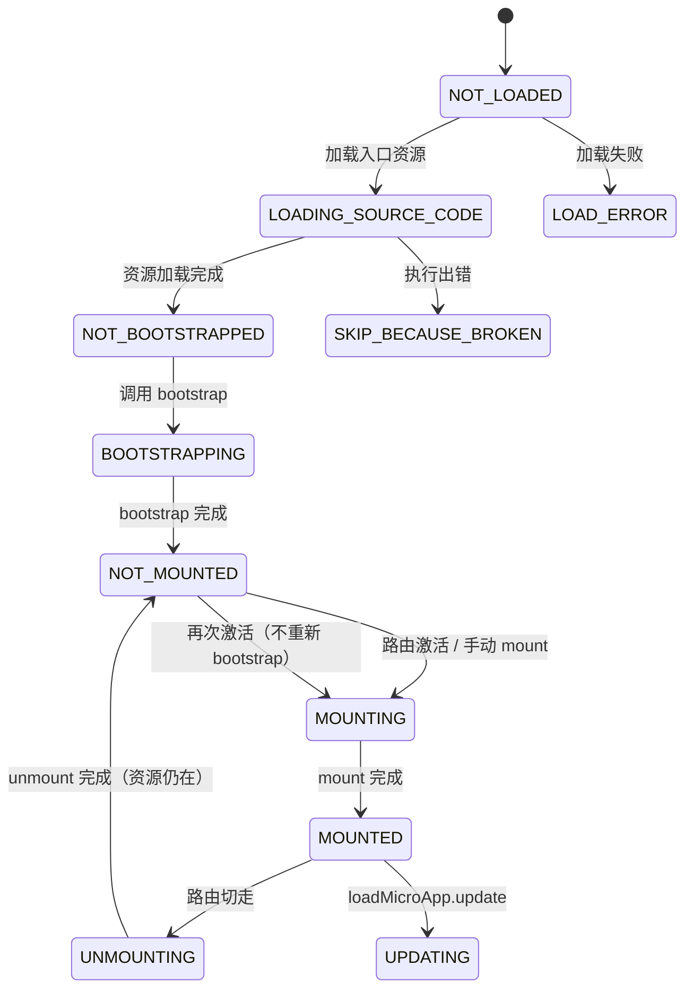
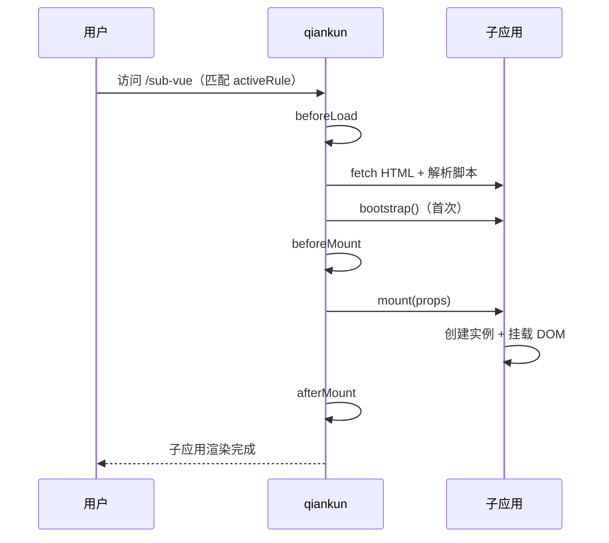

# qiankun 生命周期

> 📖 官方文档：[生命周期钩子](https://qiankun.umijs.org/zh/guide/getting-started#%E5%BE%AE%E5%BA%94%E7%94%A8) | [single-spa 生命周期](https://single-spa.js.org/docs/building-applications#lifecycle)

qiankun 基于 single-spa，通过**生命周期钩子**管理子应用的加载、挂载、卸载。理解生命周期是写好子应用的前提。

## 一、生命周期概览

生命周期分两类：

| 类别 | 定义方 | 钩子 | 作用 |
| --- | --- | --- | --- |
| **子应用生命周期** | 子应用（`export`） | `bootstrap` / `mount` / `unmount` / `update` | 子应用控制自己的初始化、渲染、清理 |
| **主应用生命周期** | 主应用（`registerMicroApps` 第二参） | `beforeLoad` / `beforeMount` / `afterMount` / `beforeUnmount` / `afterUnmount` | 主应用在关键节点做埋点、日志、loading 控制 |

> 💡 **关键认知：** `bootstrap` 只在子应用**首次加载时执行一次**，之后无论激活/失活多少次，都只反复执行 `mount` ↔ `unmount`。这正是「子应用不重复加载资源」的原因。

## 二、子应用生命周期详解

### 2.1 bootstrap —— 初始化

```ts
export async function bootstrap() {
  console.log('[子应用] bootstrap')
  // 适合做：全局级别的初始化（只执行一次）
  // - 加载公共配置
  // - 初始化全局变量
  // 不适合：访问 props（此时 props 尚未传入）、操作 DOM
}
```

| 属性 | 说明 |
| --- | --- |
| 执行时机 | 子应用首次被加载、资源解析完成后 |
| 执行次数 | **整个生命周期只执行 1 次** |
| 参数 | 无 |
| 用途 | 一次性初始化，避免每次 mount 重复执行 |

### 2.2 mount —— 挂载

```ts
export async function mount(props) {
  const {
    container,        // 子应用挂载容器
    routerBase,       // 自定义 props
    onGlobalStateChange,  // 全局状态监听（见 06）
    setGlobalState
  } = props

  // 适合做：创建应用实例、挂载 DOM、启动路由、监听全局状态
  render(props)
}
```

| 属性 | 说明 |
| --- | --- |
| 执行时机 | 子应用被激活、`bootstrap` 完成后 |
| 执行次数 | 每次激活执行 1 次 |
| 参数 | `props`（主应用传入的数据 + 通信方法） |
| 用途 | 渲染应用、注册副作用 |

> ⚠️ **注意：** `mount` 里创建的实例、定时器、事件监听，都要在 `unmount` 里对应清理，否则会内存泄漏。

### 2.3 unmount —— 卸载

```ts
export async function unmount(props) {
  // 适合做：销毁实例、清空容器、移除所有副作用
  instance?.$destroy()
  instance.$el.innerHTML = ''   // 清空容器
  instance = null
  router = null

  // 清理定时器、事件监听等
  clearInterval(timer)
  window.removeEventListener('resize', handler)
}
```

| 属性 | 说明 |
| --- | --- |
| 执行时机 | 子应用失活（路由切走、被替换）时 |
| 执行次数 | 每次失活执行 1 次 |
| 参数 | `props` |
| 用途 | 销毁应用、清理副作用 |

> 💡 **提示：** `unmount` 后子应用**资源仍在内存**（没有真正卸载），下次激活时直接走 `mount`，不再重新 `bootstrap`。这是「二次进入秒开」的原因。

### 2.4 update —— 更新（可选）

```ts
export async function update(props) {
  console.log('[子应用] update', props)
  // 增量更新 props，而非整体重渲染
}
```

| 属性 | 说明 |
| --- | --- |
| 执行时机 | 主应用调用 `microApp.update(newProps)` 时 |
| 执行次数 | 每次调用 `update` 执行 1 次 |
| 参数 | 新的 `props` |
| 用途 | 仅 `loadMicroApp` 手动加载场景需要 |

> 💡 **提示：** 基于路由自动激活的场景用不到 `update`；只有手动 `loadMicroApp` 并需要动态更新子应用 props 时才导出它。

## 三、主应用生命周期钩子

在 `registerMicroApps` 第二个参数配置，作用于**所有子应用**：

```ts
registerMicroApps(apps, {
  beforeLoad:    (app) => { /* 子应用资源加载前 */ },
  beforeMount:   (app) => { /* 子应用挂载前 */ },
  afterMount:    (app) => { /* 子应用挂载后 */ },
  beforeUnmount: (app) => { /* 子应用卸载前 */ },
  afterUnmount:  (app) => { /* 子应用卸载后 */ }
})
```

| 钩子 | 时机 | 典型用途 |
| --- | --- | --- |
| `beforeLoad` | fetch 子应用资源前 | 显示全局 loading |
| `beforeMount` | 子应用 `mount` 前 | 埋点、切换 loading 状态 |
| `afterMount` | 子应用 `mount` 后 | 隐藏 loading、上报页面到达 |
| `beforeUnmount` | 子应用 `unmount` 前 | 保存离开前状态 |
| `afterUnmount` | 子应用 `unmount` 后 | 清理临时数据 |

每个钩子接收 `app` 参数（含 `name`/`entry` 等注册信息），返回 `Promise`。也支持数组按序执行：

```ts
beforeMount: [
  (app) => { console.log('第一步', app.name) },
  (app) => { console.log('第二步', app.name) }
]
```

## 四、状态机流转

每个子应用实例都有一个内部状态，`getStatus()` 可查询：



> 💡 **关键路径：** `NOT_MOUNTED → MOUNTING → MOUNTED → UNMOUNTING → NOT_MOUNTED` 是日常路由切换反复走的循环。`bootstrap` 只在 `NOT_BOOTSTRAPPED → BOOTSTRAPPING` 走一次。

## 五、完整执行顺序

以「用户从首页点击进入子应用 A，再切到子应用 B」为例：

```text
【首次进入子应用 A】
beforeLoad(A)        ← 主应用钩子
  └─ fetch A 的 HTML/JS/CSS
bootstrap(A)         ← 子应用（只执行这一次）
beforeMount(A)       ← 主应用钩子
mount(A)             ← 子应用渲染
afterMount(A)        ← 主应用钩子

【从 A 切换到 B】
beforeUnmount(A)     ← 主应用钩子
unmount(A)           ← 子应用清理（A 资源仍留存）
afterUnmount(A)      ← 主应用钩子
beforeLoad(B)        ← 主应用钩子
  └─ fetch B 的资源
bootstrap(B)         ← 子应用（B 首次加载）
beforeMount(B)
mount(B)
afterMount(B)

【再次切回 A】
beforeUnmount(B)
unmount(B)
afterUnmount(B)
beforeMount(A)       ← A 不再 beforeLoad / bootstrap，直接 mount
mount(A)             ← 秒开
afterMount(A)
```

用时序图表示首次进入：



## 六、注意事项

### 6.1 bootstrap 不要依赖 props

`bootstrap` 执行时主应用的 `props` 尚未传入，需要 `props` 的逻辑（如读路由前缀、监听全局状态）必须放到 `mount` 里。

```ts
// ❌ bootstrap 里拿不到 props
export async function bootstrap() {
  const { routerBase } = props  // props 未定义！
}

// ✅ 在 mount 里用 props
export async function mount(props) {
  const { routerBase } = props
}
```

### 6.2 unmount 必须彻底清理

`unmount` 是防止内存泄漏的最后机会，所有在 `mount` 创建的副作用都要在这里清掉：

```ts
// mount 里注册的，unmount 里都要对应移除
mount:   window.addEventListener('resize', handler)
unmount: window.removeEventListener('resize', handler)

mount:   setInterval(...)
unmount: clearInterval(...)

mount:   app = createApp(...)
unmount: app.unmount()
```

### 6.3 钩子必须是 async 函数

四个钩子都要返回 `Promise`（即使用 `async` 关键字），qiankun 会 `await` 它们。同步函数会导致流程异常。

### 6.4 不要在生命周期外执行副作用

子应用入口顶层代码（`bootstrap` 之外的）会在模块加载时执行一次。避免在这里直接 `new Vue()` 并挂载——应统一在 `mount` 里渲染，由 qiankun 控制时机。

## 七、总结

- 子应用四钩子：`bootstrap`（1 次）→ `mount`（每次激活）→ `unmount`（每次失活）→ `update`（可选）
- 主应用五钩子：`beforeLoad` / `beforeMount` / `afterMount` / `beforeUnmount` / `afterUnmount`
- `bootstrap` 只执行一次，是「二次进入秒开」的关键
- `unmount` 必须彻底清理副作用，防止内存泄漏
- 状态机：`NOT_LOADED → ... → MOUNTED ↔ NOT_MOUNTED` 循环

下一篇：[应用间通信](./06-应用间通信.md) 讲解主子应用与子应用之间的数据传递。
