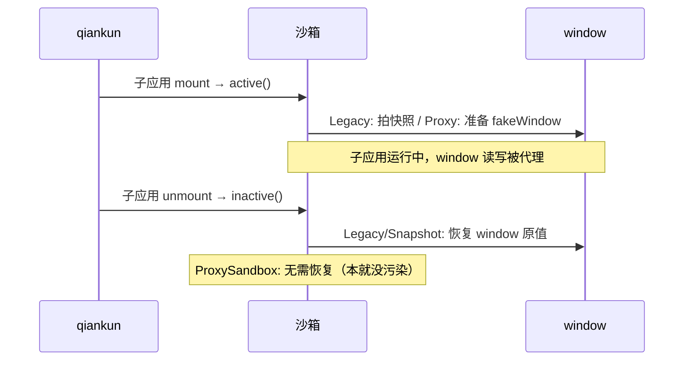

# qiankun JS 沙箱

> 📖 官方文档：[API - sandbox](https://qiankun.umijs.org/zh/api#startopts) | [源码 sandbox 目录](https://github.com/umijs/qiankun/tree/master/src/sandbox)

JS 沙箱是 qiankun 的核心能力之一，它让每个子应用对 `window` 的修改互不干扰。本文讲解三种沙箱的原理、激活失活机制，以及它们「能隔离什么、不能隔离什么」。

## 一、为什么需要 JS 沙箱

没有沙箱时，多个子应用共享同一个 `window`，会互相污染：

```ts
// 子应用 A 启动时
window.appConfig = { theme: 'dark' }

// 子应用 B 启动时
window.appConfig = { theme: 'light' }  // 覆盖了 A 的配置！

// 切回子应用 A
console.log(window.appConfig.theme)  // 'light'，A 的配置被污染了
```

更严重的问题：全局变量覆盖、第三方库冲突（如两个子应用用不同版本 jQuery）、`window.onload` 互相覆盖等。

**JS 沙箱的作用**：让每个子应用拥有「自己的 `window`」，对全局变量的读写被隔离，卸载后恢复原状。

## 二、qiankun 三种沙箱

qiankun 根据环境（是否支持 Proxy）和模式（单实例/多实例）选择沙箱：

| 沙箱类型 | 适用条件 | 模式 | 原理 |
| --- | --- | --- | --- |
| **ProxySandbox** | 支持 Proxy | 多实例 | 每个子应用独立 `fakeWindow`，Proxy 代理 |
| **LegacySandbox** | 支持 Proxy | 单实例 | 代理真实 `window`，记录修改并恢复 |
| **SnapshotSandbox** | 不支持 Proxy（旧浏览器） | 单实例 | 快照 diff，激活/失活对比 `window` |

选择逻辑：

```text
singular: false（多实例）
  └─ 必须用 ProxySandbox（每个子应用独立 fakeWindow）

singular: true（单实例，默认）
  ├─ 支持 Proxy → LegacySandbox
  └─ 不支持 Proxy → SnapshotSandbox（降级）
```

> 💡 **提示：** `singular` 默认 `true`，所以大多数场景用的是 LegacySandbox（有 Proxy）。多实例（`singular: false`）才用 ProxySandbox。

## 三、ProxySandbox 原理（多实例）

每个子应用拥有一个独立的 `fakeWindow`，所有写操作只发生在 `fakeWindow` 上，**完全不污染真实 `window`**，因此多实例可并存。

简化实现：

```ts
class ProxySandbox {
  private fakeWindow = Object.create(null)  // 子应用专属的假 window
  public proxyWindow: Window
  private active = false

  constructor() {
    this.proxyWindow = new Proxy(this.fakeWindow, {
      // 读取：先查 fakeWindow，没有再查真实 window
      get: (target, key: string) => {
        if (key in target) return target[key]
        const value = (window as any)[key]
        // 函数需绑定真实 window（如 setTimeout、document 等）
        return typeof value === 'function' ? value.bind(window) : value
      },
      // 写入：只写 fakeWindow，真实 window 不受影响
      set: (target, key: string, value) => {
        target[key] = value
        return true
      },
      // 让子应用认为 window 上「什么都有」
      has: () => true
    })
  }

  active() { this.active = true }
  inactive() { this.active = false }
  // ⭐ 不需要恢复：因为从没污染过真实 window
}
```

**关键点**：

- `set` 只写 `fakeWindow` → 真实 `window` 永不被污染 → 多实例天然隔离
- `has` 返回 `true` → 子应用用 `if ('xxx' in window)` 判断时永远为真，避免某些库的兼容检测失败
- **不需要恢复**：因为本来就没动真实 `window`

## 四、LegacySandbox 原理（单实例）

单实例场景同一时刻只有一个子应用激活，它直接代理真实 `window`，但**记录**子应用新增/修改的属性，失活时**恢复**。

```ts
class LegacySandbox {
  private addedProps = new Map()   // 子应用新增的属性
  private modifiedProps = new Map() // 子应用修改的属性
  public proxyWindow: Window

  constructor() {
    this.proxyWindow = new Proxy(window, {
      set: (target, key, value) => {
        if (!(key in target)) {
          // 新增属性：记录下来，失活时删除
          this.addedProps.set(key, value)
        } else if (target[key] !== value) {
          // 修改已有属性：记录原值，失活时恢复
          this.modifiedProps.set(key, target[key])
        }
        target[key] = value  // 写入真实 window
        return true
      }
    })
  }

  // 失活：恢复真实 window
  inactive() {
    // 删除子应用新增的属性
    this.addedProps.forEach((_, key) => delete (window as any)[key])
    // 恢复子应用修改的属性
    this.modifiedProps.forEach((value, key) => (window as any)[key] = value)
    this.addedProps.clear()
    this.modifiedProps.clear()
  }
}
```

**与 ProxySandbox 的区别**：LegacySandbox 写入真实 `window`，靠失活时恢复来隔离；ProxySandbox 不写真实 `window`，无需恢复。

## 五、SnapshotSandbox 原理（降级方案）

不支持 Proxy 的环境（如旧浏览器），用「快照 + diff」实现隔离：激活前快照 `window`，失活时对比差异并恢复。

```ts
class SnapshotSandbox {
  private snapshot: Record<string, any> = {}  // 激活前的快照
  private modifyMap: Record<string, any> = {} // 记录修改

  active() {
    // 激活：拍快照 + 恢复上次修改
    this.snapshot = {}
    for (const key in window) {
      this.snapshot[key] = (window as any)[key]
    }
    // 重新激活时，恢复之前的修改
    Object.keys(this.modifyMap).forEach(key => {
      (window as any)[key] = this.modifyMap[key]
    })
  }

  inactive() {
    // 失活：对比差异，记录修改并恢复原值
    this.modifyMap = {}
    for (const key in window) {
      if ((window as any)[key] !== this.snapshot[key]) {
        this.modifyMap[key] = (window as any)[key]  // 记录修改
        ;(window as any)[key] = this.snapshot[key]  // 恢复原值
      }
    }
  }
}
```

> ⚠️ **注意：** SnapshotSandbox 性能较差（每次激活/失活都遍历 `window`），且只支持单实例。现代浏览器基本用不到，仅作降级。

## 六、激活与失活流程

子应用 `mount` 时沙箱**激活**，`unmount` 时**失活**：



## 七、沙箱能隔离什么 / 不能隔离什么

### 7.1 能隔离

| 能力 | 说明 |
| --- | --- |
| `window` 全局变量读写 | 子应用 A 的 `window.x` 不影响 B |
| 第三方库全局变量 | 不同版本库的 `window.jQuery` 等 |
| `has` 检测 | `in window` 判断被代理 |

### 7.2 不能隔离（需手动处理）

| 不能隔离 | 原因 | 处理方式 |
| --- | --- | --- |
| **定时器** `setTimeout`/`setInterval` | 返回真实 id，沙箱不追踪 | `unmount` 时 `clearTimeout`/`clearInterval` |
| **事件监听** `addEventListener` | 绑在真实 DOM 上 | `unmount` 时 `removeEventListener` |
| **DOM 修改** `document.body.appendChild` | 沙箱不管 DOM 结构 | 避免往 body/html 加节点，或卸载时移除 |
| **localStorage / sessionStorage** | 浏览器全局存储，共享 | 加命名空间前缀隔离 key |
| **cookie** | 浏览器全局，共享 | 按域名/path 隔离 |
| **全局样式** `body {...}` | CSS 范畴，JS 沙箱不管 | 用样式隔离（见 [08-样式隔离](./08-样式隔离.md)） |

```ts
// ❌ 沙箱管不了的，会泄漏
export async function mount() {
  setInterval(() => console.log('tick'), 1000)  // unmount 后还在跑！
  window.addEventListener('resize', handler)     // unmount 后还监听！
}

// ✅ 手动清理
let timer, handler
export async function mount() {
  timer = setInterval(() => console.log('tick'), 1000)
  handler = () => {}
  window.addEventListener('resize', handler)
}
export async function unmount() {
  clearInterval(timer)
  window.removeEventListener('resize', handler)
}
```

### 7.3 Vite ESM 子应用不在沙箱内

`vite-plugin-qiankun` 实现的子应用**不运行在 JS 沙箱中**（ESM 加载方式与沙箱冲突）。操作 `window` 必须用 `qiankunWindow`：

```ts
import { qiankunWindow } from 'vite-plugin-qiankun/dist/helper'

// ❌ 直接用 window 可能污染其他子应用
window.customProp = 'x'

// ✅ 用 qiankunWindow
qiankunWindow.customProp = 'x'
```

## 八、常见问题

### 8.1 子应用全局变量丢失

子应用在 `mount` 外（模块顶层）写入的 `window.xxx`，在 ProxySandbox 下不会进真实 `window`，重新激活时可能丢失。建议在 `mount` 内初始化全局变量。

### 8.2 定时器/事件未清理导致内存泄漏

沙箱不自动清理定时器和事件监听，必须在 `unmount` 手动清理（见 7.2）。这是最常见的泄漏源。

### 8.3 沙箱导致第三方库检测失败

某些库用 `'xxx' in window` 或 `typeof window.xxx` 做能力检测。ProxySandbox 的 `has` 返回 `true` 可能让检测失真。若子应用库异常，可尝试排除该库（`excludeAssetFilter`）或降级处理。

### 8.4 关闭沙箱

特殊场景可关闭沙箱（`sandbox: false`），但此时子应用间全局变量会互相污染，**极不推荐**：

```ts
start({ sandbox: false })  // ⚠️ 子应用全局变量不再隔离
```

## 九、总结

- 三种沙箱：ProxySandbox（多实例）、LegacySandbox（单实例+Proxy）、SnapshotSandbox（降级）
- ProxySandbox 用独立 `fakeWindow`，不污染真实 `window`；Legacy/Snapshot 靠失活恢复
- 沙箱只隔离 `window` 读写，**不隔离**定时器、事件监听、DOM、localStorage
- 定时器和事件监听必须在 `unmount` 手动清理
- Vite ESM 子应用不在沙箱内，操作全局用 `qiankunWindow`

下一篇：[样式隔离](./08-样式隔离.md) 讲解 CSS 隔离方案。
