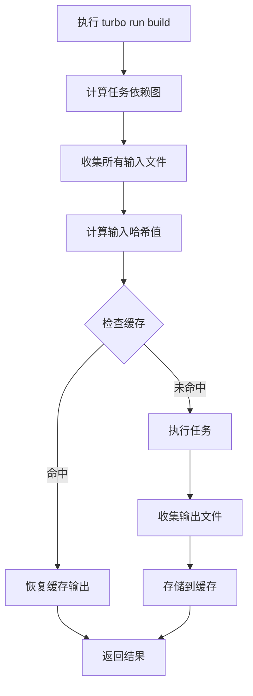

# Turbo 详解

> Turbo 是 Vercel 开源的高性能构建系统，专为 Monorepo 设计，通过智能缓存和增量构建提升开发体验。

## 一、什么是 Turbo

### 1.1 背景

```
┌─────────────────────────────────────────────────────────────────┐
│                    Monorepo 构建痛点                            │
├─────────────────────────────────────────────────────────────────┤
│                                                                 │
│  ❌ 每次都要重新构建所有包                                      │
│  ❌ 即使只改了一行代码，也要等很久                              │
│  ❌ CI/CD 浪费时间重复构建                                      │
│  ❌ 团队成员每个人都要构建相同的产物                             │
│  ❌ 不知道哪些包真正需要重新构建                                │
│                                                                 │
│  ┌──────────────────────────────────────────────────────┐      │
│  │              Turbo 解决方案                           │      │
│  ├──────────────────────────────────────────────────────┤      │
│  │  ✅ 只构建改变的包及相关依赖                          │      │
│  │  ✅ 缓存构建产物，命中后毫秒级返回                    │      │
│  │  ✅ 团队共享缓存，避免重复工作                        │      │
│  │  ✅ 自动并行执行任务                                 │      │
│  │  ✅ 零配置即可使用                                   │      │
│  └──────────────────────────────────────────────────────┘      │
│                                                                 │
└─────────────────────────────────────────────────────────────────┘
```

### 1.2 核心概念

| 概念 | 说明 |
|------|------|
| **任务（Task）** | package.json 中定义的脚本命令 |
| **管道（Pipeline）** | 定义任务间的依赖关系和缓存策略 |
| **缓存（Cache）** | 存储任务输入和输出的映射关系 |
| **哈希（Hash）** | 基于输入内容生成的唯一标识 |
| **增量构建** | 只执行受影响变更影响的任务 |

---

## 二、工作原理

### 2.1 执行流程



### 2.2 哈希计算

```typescript
// Turbo 哈希计算逻辑（简化）
function calculateHash(task: Task): string {
  const inputs = [
    // 1. 源代码内容
    readFiles(task.inputs),

    // 2. 环境变量
    getEnvVars(task.globalEnv),

    // 3. 依赖版本
    getDependencyVersions(task.package),

    // 4. Turbo 配置
    getTurboConfig(),

    // 5. 工具链版本
    getToolVersions(['node', 'pnpm', 'typescript'])
  ]

  return hash(inputs.join(''))
}
```

### 2.3 缓存存储

```
┌─────────────────────────────────────────────────────────────────┐
│                        Turbo 缓存层                             │
├─────────────────────────────────────────────────────────────────┤
│                                                                 │
│  本地缓存 (~/.cache/turbo)         远程缓存                    │
│  ┌─────────────────────┐           ┌─────────────────────┐     │
│  │  键: 任务哈希值      │           │  Vercel / 自建       │     │
│  │  值: 输出文件 + 元数据│  ◀──────▶│  团队共享            │     │
│  └─────────────────────┘           └─────────────────────┘     │
│           ▲                              ▲                      │
│           │                              │                      │
│           └──────────┬───────────────────┘                      │
│                      │                                           │
│                      ▼                                           │
│              查找顺序:                                          │
│              1. 本地缓存 (最快)                                  │
│              2. 远程缓存 (团队共享)                              │
│              3. 执行任务并缓存                                   │
│                                                                 │
└─────────────────────────────────────────────────────────────────┘
```

---

## 三、安装与配置

### 3.1 安装

```bash
# 使用 pnpm（推荐）
pnpm add -D turbo

# 使用 npm
npm install -D turbo

# 使用 yarn
yarn add -D turbo

# 全局安装
pnpm add -g turbo
```

### 3.2 基础配置

```json
// turbo.json
{
  "$schema": "https://turbo.build/schema.json",
  "globalDependencies": [
    "**/.env.*local",
    "tsconfig.json"
  ],
  "globalEnv": [
    "NODE_ENV",
    "VITE_API_BASE_URL"
  ],
  "pipeline": {
    "build": {
      "dependsOn": ["^build"],
      "outputs": [".next/**", "!.next/cache/**", "dist/**"]
    },
    "dev": {
      "cache": false,
      "persistent": true
    },
    "lint": {
      "outputs": []
    },
    "test": {
      "dependsOn": ["build"],
      "outputs": ["coverage/**"],
      "inputs": ["src/**/*.tsx", "test/**/*.tsx"]
    }
  }
}
```

### 3.3 package.json

```json
{
  "name": "monorepo",
  "private": true,
  "scripts": {
    "dev": "turbo run dev",
    "build": "turbo run build",
    "lint": "turbo run lint",
    "test": "turbo run test",
    "clean": "turbo run clean && rm -rf node_modules"
  },
  "devDependencies": {
    "turbo": "^1.11.0"
  }
}
```

---

## 四、管道配置详解

### 4.1 管道选项

```json
{
  "pipeline": {
    "任务名": {
      // 依赖关系
      "dependsOn": ["^任务名"],     // 依赖其他包的同名任务
      "dependsOn": ["^build", "lint"], // 依赖多个任务

      // 输出配置
      "outputs": ["dist/**"],        // 需要缓存的输出路径
      "outputs": [],                 // 无输出（如 lint）

      // 输入配置（影响哈希）
      "inputs": ["src/**/*.ts"],     // 默认所有文件
      "inputs": [".env.*"],          // 包含环境变量

      // 缓存控制
      "cache": true,                 // 是否缓存（默认 true）
      "cache": false,                // 禁用缓存

      // 持久运行
      "persistent": true,            // 进程持续运行（如 dev server）

      // 环境变量
      "env": ["CUSTOM_VAR"],         // 影响哈希的环境变量
      "env": ["NEXT_PUBLIC_*"],      // 通配符匹配

      // 输入输出验证
      "outputMode": "new-only",      // 只缓存新文件
      "outputMode": "full",          // 完整输出

      // DAG（有向无环图）配置
      "topological": true,           // 按依赖顺序执行
      "parallel": false              // 禁用并行
    }
  }
}
```

### 4.2 常见任务配置

```json
{
  "pipeline": {
    // 开发服务器
    "dev": {
      "cache": false,
      "persistent": true
    },

    // 构建
    "build": {
      "dependsOn": ["^build"],
      "outputs": ["dist/**", ".next/**", "!.next/cache/**"]
    },

    // 类型检查
    "type-check": {
      "dependsOn": ["^build"],
      "outputs": []
    },

    // 代码检查
    "lint": {
      "outputs": [],
      "inputs": ["src/**/*.tsx", "tests/**/*.tsx"]
    },

    // 测试
    "test": {
      "dependsOn": ["build"],
      "outputs": ["coverage/**"],
      "inputs": ["src/**/*.tsx", "tests/**/*.tsx"]
    },

    // 清理
    "clean": {
      "cache": false
    },

    // 开发环境构建
    "dev:build": {
      "cache": false,
      "outputs": ["dev-dist/**"]
    }
  }
}
```

### 4.3 高级配置

```json
{
  "pipeline": {
    "build": {
      "dependsOn": ["^build"],
      "outputs": ["dist/**"],
      // 精确控制输入
      "inputs": [
        "src/**",
        "package.json",
        "tsconfig.json",
        "vite.config.ts",
        "!src/**/*.test.ts",
        "!src/**/*.spec.ts"
      ],
      // 多个环境变量
      "env": [
        "NODE_ENV",
        "API_URL",
        "PUBLIC_*",      // 通配符
        "STRIPE_*"
      ],
      // 仅在新文件输出时缓存
      "outputMode": "new-only"
    },
    "test": {
      "dependsOn": ["build"],
      "outputs": ["coverage/**"],
      // 自定义输入 Glob 模式
      "inputs": [
        "src/**/*.ts",
        "test/**/*.ts",
        "__mocks__/**/*.ts"
      ],
      // 禁用并行（如测试需要端口）
      "parallel": false
    }
  }
}
```

---

## 五、Filter 语法

### 5.1 基本语法

```bash
# 语法格式
turbo run build --filter=<pattern>

# 示例
turbo run build --filter=my-app
turbo run build --filter=@my-org/ui
turbo run build --filter=./apps/*
```

### 5.2 选择器类型

| 语法 | 说明 | 示例 |
|------|------|------|
| `package` | 选择包 | `--filter=my-app` |
| `package...` | 包 + 所有依赖 | `--filter=my-app...` |
| `...package` | 包 + 所有依赖者 | `--filter=...my-app` |
| `...package...` | 包 + 依赖 + 依赖者 | `--filter=...my-app...` |
| `./path/*` | 目录匹配 | `--filter=./apps/*` |
| `[HEAD^1]` | Git 变更 | `--filter=[HEAD^1]` |

### 5.3 实用示例

```bash
# 只构建 web 应用
turbo run build --filter=web

# 构建 web 及其所有依赖
turbo run build --filter=web...

# 构建 ui 及所有依赖它的包
turbo run build --filter=...ui

# 构建根目录 apps 下的所有包
turbo run build --filter=./apps/*

# 排除特定包
turbo run build --filter=!./apps/admin

# 构建上次提交改变的包
turbo run build --filter=[HEAD^1]

# 构建当前分支改变的包
turbo run build --filter=[HEAD...main]

# 组合选择
turbo run build --filter=./apps/* --filter=!./apps/admin

# 使用 cwd 构建当前目录的包
turbo run build --filter=[HEAD]

# 多个选择器（OR 关系）
turbo run build --filter={web,admin}
```

### 5.4 依赖图选择

```
依赖关系示例:
┌─────────────────────────────────────────────────────────────────┐
│                                                                 │
│                      ui (组件库)                                │
│                    /   |   \                                    │
│            ┌─────┬─────┴─────┬─────┐                          │
│           web   admin  mobile  api                           │
│            |      |      |      |                            │
│            └──────┴──────┴──────┘                            │
│                   common                                     │
│                                                                 │
└─────────────────────────────────────────────────────────────────┘

选择器结果:
--filter=ui           → ui
--filter=ui...         → ui, web, admin, mobile, api
--filter=...ui         → ui, web, admin, mobile, api
--filter=...common     → common, web, admin, mobile, api, ui
--filter=web...        → web, ui
--filter=...web        → web, common, ui
```

---

## 六、缓存机制

### 6.1 缓存策略

```typescript
// Turbo 缓存决策逻辑
interface CacheDecision {
  // 1. 检查本地缓存
  localCache: {
    exists: boolean
    valid: boolean
    hash: string
  }

  // 2. 检查远程缓存
  remoteCache: {
    exists: boolean
    valid: boolean
    url: string
  }

  // 3. 决策
  decision: "HIT_LOCAL" | "HIT_REMOTE" | "MISS"
}
```

### 6.2 缓存目录

```
~/.cache/turbo/
├── hashes/
│   ├── xxxxxxxxxxxxxxxxxxxxxxxxxxxxxxxx
│   │   ├── output/
│   │   │   ├── dist/
│   │   │   └── .next/
│   │   └── metadata.json
│   └── yyyyyyyyyyyyyyyyyyyyyyyyyyyyyyyy
└── lock
```

### 6.3 缓存清理

```bash
# 清除所有缓存
turbo prune --force

# 清除特定任务缓存
turbo run build --force

# 清理并重新构建
turbo run build --force --dry-run

# 查看缓存状态
turbo run build --dry-run
```

### 6.4 缓存验证

```bash
# 验证缓存完整性
turbo run build --force

# 跳过缓存（调试用）
NODE_ENV=development turbo run build --force

# 查看缓存键
turbo run build --dry-run --verbose
```

---

## 七、远程缓存

### 7.1 Vercel 远程缓存

```bash
# 登录
npx turbo login

# 链接项目
npx turbo link

# 自动使用远程缓存
turbo run build
```

### 7.2 自建远程缓存

```typescript
// turbo 服务器配置
// turbo.json
{
  "remoteCache": {
    "enabled": true,
    "url": "https://cache.your-domain.com",
    "token": "${TURBO_TOKEN}",
    "teamId": "your-team-id"
  }
}
```

```bash
# 使用环境变量
export TURBO_TOKEN=your-token
export TURBO_TEAM=your-team
turbo run build
```

### 7.3 S3 兼容缓存

```bash
# 使用 AWS S3
turbo run build \
  --token="${AWS_ACCESS_KEY_ID}" \
  --team="${AWS_S3_BUCKET}"
```

### 7.4 本地网络缓存

```bash
# 自建缓存服务器
docker run -d \
  -p 3000:3000 \
  -v /tmp/turbo-cache:/data \
  ghcr.io/vercel/turbo-canary:latest \
  turbo-server \
  --cache-dir=/data

# 连接到本地缓存
turbo run build --url="http://localhost:3000"
```

---

## 八、Monorepo 集成

### 8.1 pnpm workspace

```yaml
# pnpm-workspace.yaml
packages:
  - 'apps/*'
  - 'packages/*'
```

```json
// turbo.json
{
  "pipeline": {
    "build": {
      "dependsOn": ["^build"],
      "outputs": ["dist/**"]
    }
  }
}
```

### 8.2 npm workspaces

```json
// package.json
{
  "workspaces": [
    "apps/*",
    "packages/*"
  ]
}
```

### 8.3 yarn workspaces

```json
// package.json
{
  "workspaces": [
    "apps/*",
    "packages/*"
  ]
}
```

### 8.4 完整示例

```
my-monorepo/
├── apps/
│   ├── web/
│   │   ├── package.json
│   │   └── src/
│   └── admin/
│       ├── package.json
│       └── src/
├── packages/
│   ├── ui/
│   │   ├── package.json
│   │   └── src/
│   └── shared/
│       ├── package.json
│       └── src/
├── turbo.json
├── pnpm-workspace.yaml
└── package.json
```

```json
// package.json
{
  "name": "my-monorepo",
  "private": true,
  "scripts": {
    "build": "turbo run build",
    "dev": "turbo run dev",
    "lint": "turbo run lint",
    "test": "turbo run test",
    "clean": "turbo run clean && rm -rf node_modules"
  },
  "devDependencies": {
    "turbo": "^1.11.0"
  }
}
```

```json
// turbo.json
{
  "$schema": "https://turbo.build/schema.json",
  "pipeline": {
    "build": {
      "dependsOn": ["^build"],
      "outputs": [".next/**", "!.next/cache/**", "dist/**"]
    },
    "dev": {
      "cache": false,
      "persistent": true
    },
    "lint": {
      "outputs": []
    },
    "test": {
      "dependsOn": ["^build"],
      "outputs": ["coverage/**"]
    },
    "clean": {
      "cache": false
    }
  }
}
```

---

## 九、最佳实践

### 9.1 管道设计原则

```json
{
  "pipeline": {
    // 1. 开发服务器不缓存
    "dev": {
      "cache": false,
      "persistent": true
    },

    // 2. 构建任务依赖上游构建
    "build": {
      "dependsOn": ["^build"],
      "outputs": ["dist/**", ".next/**"]
    },

    // 3. 测试依赖构建
    "test": {
      "dependsOn": ["build"],
      "outputs": ["coverage/**"]
    },

    // 4. Lint 不依赖其他任务
    "lint": {
      "outputs": []
    },

    // 5. 类型检查可选依赖构建
    "type-check": {
      "dependsOn": ["^build"],
      "outputs": []
    }
  }
}
```

### 9.2 性能优化

```bash
# 1. 并行执行
turbo run build test lint

# 2. 只构建改变的包
turbo run build --filter=[HEAD^1]

# 3. 跳过未使用的包
turbo run build --filter=./apps/*

# 4. 使用远程缓存
turbo run build

# 5. 清理旧缓存
turbo prune --force
```

### 9.3 调试技巧

```bash
# 查看执行计划
turbo run build --dry-run

# 查看详细信息
turbo run build --verbose

# 强制重新执行
turbo run build --force

# 查看任务图
turbo run build --graph --dirtree

# 查看依赖关系
turbo run build --force --explain
```

---

## 十、进阶功能

### 10.1 任务继承

```json
{
  "pipeline": {
    "build": {
      "dependsOn": ["^build"],
      "outputs": ["dist/**"]
    },
    "#build": {
      "outputs": ["dist/**"]
    },
    "build:production": {
      "extends": "#build",
      "env": ["NODE_ENV=production"]
    }
  }
}
```

### 10.2 条件执行

```bash
# 只在 CI 环境执行
if [ "$CI" = "true" ]; then
  turbo run build
else
  turbo run dev
fi

# 只在主分支执行
turbo run build --filter=[HEAD...main]
```

### 10.3 监控与日志

```bash
# 输出 JSON 日志
turbo run build --json

# 输出 HTML 报告
turbo run build --html

# 设置日志级别
turbo run build --log-level=debug
```

### 10.4 自定义钩子

```json
{
  "pipeline": {
    "build": {
      "dependsOn": ["^build", "prebuild"],
      "outputs": ["dist/**"]
    },
    "prebuild": {
      "outputs": []
    },
    "postbuild": {
      "dependsOn": ["build"],
      "outputs": []
    }
  }
}
```

---

## 十一、常见问题

### 11.1 缓存未命中

```bash
# 查看为什么缓存未命中
turbo run build --explain --verbose

# 常见原因:
# 1. 输入文件变化
# 2. 环境变量变化
# 3. 依赖版本变化
# 4. turbo.json 配置变化
```

### 11.2 依赖循环

```bash
# 检测循环依赖
turbo run build --dry-run

# 解决方案:
# 1. 移除循环依赖
# 2. 使用 dependsOn 而非 topological
```

### 11.3 内存问题

```bash
# 限制并行任务
turbo run build --parallel=false

# 增加内存限制
NODE_OPTIONS="--max-old-space-size=8192" turbo run build
```

### 11.4 Windows 兼容性

```bash
# 使用 wsl
wsl turbo run build

# 或使用 cross-env
pnpm add -D cross-env
cross-env turbo run build
```

---

## 十二、性能对比

### 12.1 构建时间对比

```
场景: 20 个包的 Monorepo，修改 1 个包

| 方案 | 首次构建 | 缓存命中 | 改动 1 包后 |
|------|----------|----------|-------------|
| 无 Turbo | 10 分钟 | 10 分钟 | 10 分钟 |
| Turbo 本地缓存 | 10 分钟 | 2 秒 | 30 秒 |
| Turbo 远程缓存 | 10 分钟 | 5 秒 | 20 秒 |
```

### 12.2 CI/CD 提升

```
团队规模: 10 人，每日 50 次 CI

传统方案:
- 每次构建: 10 分钟
- 每日总时间: 500 分钟

Turbo 远程缓存:
- 缓存命中: 80%
- 缓存命中时间: 10 秒
- 未命中时间: 10 分钟
- 每日总时间: 80 × 10s + 10 × 600s = 168 分钟
- 节省时间: 66%
```

---

## 十三、参考资料

| 资源 | 链接 |
|------|------|
| 官方文档 | [turbo.build/repo/docs](https://turbo.build/repo/docs) |
| GitHub | [github.com/vercel/turbo](https://github.com/vercel/turbo) |
| 博客 | [vercel.com/blog/turbo](https://vercel.com/blog/turbo) |
| Discord | [discord.gg/vercel](https://discord.gg/vercel) |
